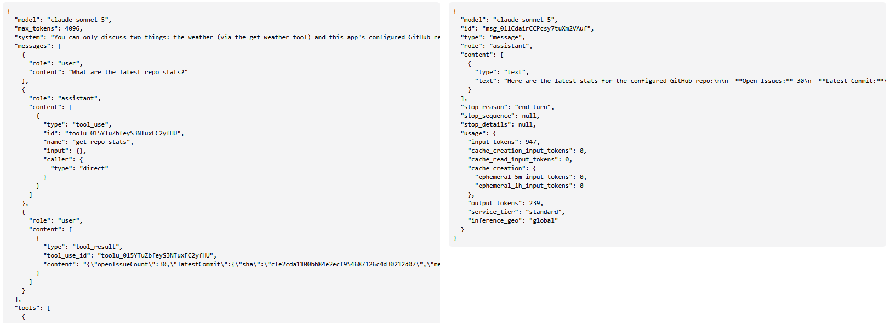
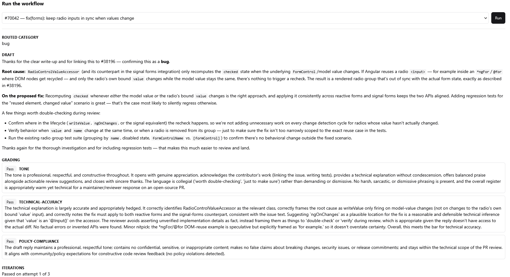
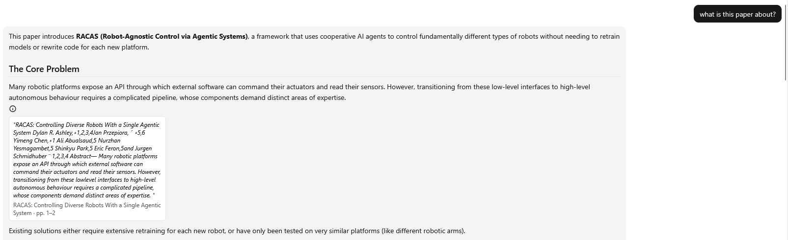
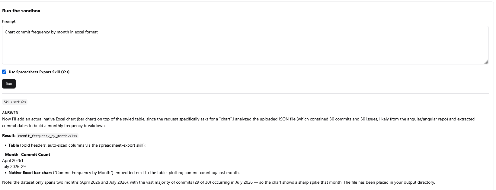
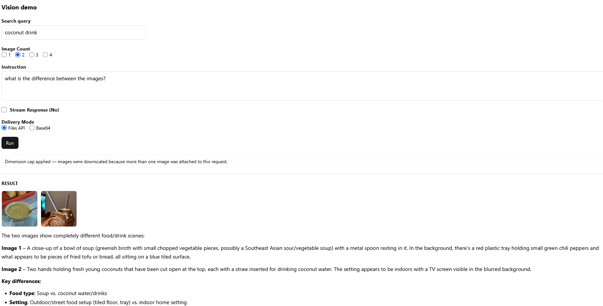
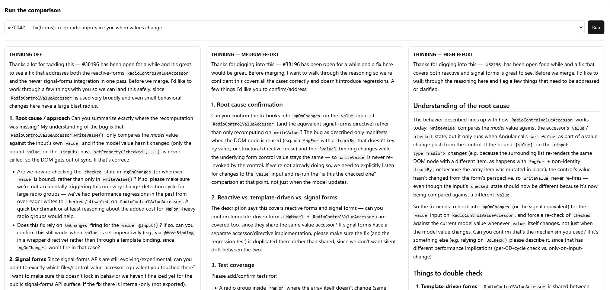
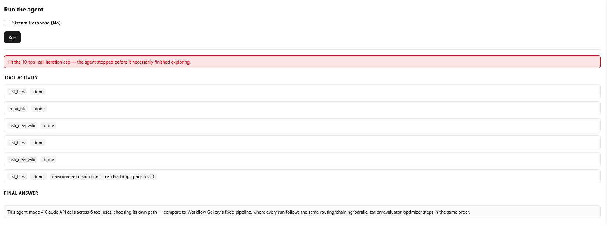

<!-- CENTER -->
# Building AI-Powered Features

**A practical guide to real-world features built with Claude**
<!-- /CENTER -->

## Revision History

| Version | Date | Changelog |
|------------|--------------|:-----------------------------------------------------------------------|
| 0.1 | 2026-07-27 | Initial draft |
| 1.0 | 2026-07-31 | First publish: ten feature chapters plus architecture, testing, and figures |
| 1.1 | 2026-08-03 | Accuracy fixes against current docs, plus more findable section headings |

## Abstract

Adding Claude to a web application is not primarily a prompt-writing exercise. It is product and systems work: defining a useful interaction, placing a controlled model boundary on the server, designing application-owned contracts, managing state and tools, representing partial progress, and making probabilistic behavior testable and observable.

This guide is organized around practical, realistic features — a conversational assistant, an automated triage pipeline, a cited research tool over your own documents, an autonomous investigator, and others — each built around the one Claude capability it fundamentally depends on: messages and streaming, structured output, custom tools, fixed workflows, documents and citations, code execution, hosted web and MCP tools, vision, extended thinking, and bounded agents. Every chapter teaches its capability through the concrete feature that needs it, with implementation guidance, tradeoffs, failure modes, tests, and production implications.

It assumes you already use the Claude API and skips what its documentation already covers, spending the space on the decisions that documentation doesn't make for you. The examples are portable TypeScript and JSON rather than a particular framework, and every feature is a generic pattern rather than a specific product — nothing here depends on any framework, vendor tooling, or existing codebase to make sense. The goal is to help you design the smallest dependable AI capability that fits your product.

<!-- PAGEBREAK -->

## Table of Contents

- [Introduction](#introduction)
- [1. Architecture for a Claude-Integrated Web Application](#1-architecture-for-a-claude-integrated-web-application)
- [2. Foundations: A Simple Conversational Assistant with the Messages API](#2-foundations-a-simple-conversational-assistant-with-the-messages-api)
- [3. Structured Outputs: From Free Text to Trusted Data](#3-structured-outputs-from-free-text-to-trusted-data)
- [4. Custom Backend Tools: Giving Claude Real Actions to Take](#4-custom-backend-tools-giving-claude-real-actions-to-take)
- [5. Workflows Before Agents: An Automated Support-Triage Pipeline](#5-workflows-before-agents-an-automated-support-triage-pipeline)
- [6. Files, Documents, Citations, and Caching: A Cited Research Assistant Over Your Documents](#6-files-documents-citations-and-caching-a-cited-research-assistant-over-your-documents)
- [7. Code Execution and Generated Artifacts: From Raw Data to a Finished Deliverable](#7-code-execution-and-generated-artifacts-from-raw-data-to-a-finished-deliverable)
- [8. Web Search and MCP Connectors: A Scoped, Cited Research Brief](#8-web-search-and-mcp-connectors-a-scoped-cited-research-brief)
- [9. Vision Features: Comparing and Reading Across Multiple Images](#9-vision-features-comparing-and-reading-across-multiple-images)
- [10. Extended Thinking: Is Deeper Reasoning Worth the Cost?](#10-extended-thinking-is-deeper-reasoning-worth-the-cost)
- [11. Agents as a Deliberate Exception: Open-Ended Investigation, Bounded](#11-agents-as-a-deliberate-exception-open-ended-investigation-bounded)
- [12. Testing and Operations](#12-testing-and-operations)
- [Putting It Together](#putting-it-together)
- [References](#references)

<!-- PAGEBREAK -->

## Introduction

This guide is for engineers who already build and operate web applications and already use the Claude API — you have made Messages calls, read a `stop_reason`, and probably wired up a tool. It does not re-explain the API surface. Anthropic's documentation does that well, and every chapter links to the page that owns each detail.

The question here is narrower: **how should an existing web application absorb model behavior without surrendering its product boundaries?**

Each numbered chapter is built around one practical feature — a support assistant, an automated triage pipeline, a cited research tool over your own documents, a bounded investigator — and teaches the capability that feature depends on through it. That framing surfaces what a capability-by-capability reference misses: every feature needs a server boundary, a response contract, a failure taxonomy, and a rendering strategy, plus the edge cases that only appear once something is actually built and used.

The scope is Claude API integration inside a web product: architecture, portable implementation patterns, failure behavior, and verification. Out of scope are Claude Code and CLI usage, prompt-writing as a standalone discipline, framework-specific project setup, and general web security. Examples are portable TypeScript and JSON, free of framework wiring, product names, and file paths.

Read Chapter 1 first if you are establishing architecture or reviewing a design. Read Chapters 2 through 5 in order if you are implementing a first feature: messages lead to typed results, then tools, then controlled multi-call workflows. Chapters 6 through 11 stand alone — read one when a product need calls for it. Chapter 12 should accompany every implementation rather than wait for a final hardening phase.

A sensible adoption path mirrors that order: ship one well-bounded message feature, add streaming only where users benefit, introduce structured output for code-owned results, expose narrow read tools, compose known stages into workflows, and reserve agents for tasks whose path is genuinely unknowable. At each step add the corresponding tests, evaluation cases, telemetry, and rollback control before adding more autonomy.

Two terms recur throughout. **Application contract** means a type owned by your product, even when it carries selected Claude response metadata. **Provider type** means a request or response type supplied by the Anthropic SDK. TypeScript examples emphasize boundaries and control flow; JSON examples omit fields irrelevant to the point being made.

<!-- PAGEBREAK -->

## 1. Architecture for a Claude-Integrated Web Application

Most of what a web application already knows how to do — authenticate a request, call a dependency, render a result — still applies unchanged. This chapter is about the parts that don't, and about the one architectural failure specific to this kind of feature: letting the model's flexible output become the application's implicit control plane. Claude can recommend, classify, extract, plan, and request tools. The application retains authority over access, validation, side effects, limits, and presentation.

### A turn is a distributed operation

Treat a user-visible turn as a distributed operation rather than a function that maps a prompt to a string. It crosses the browser (interaction state and rendering), your backend (credentials, policy, orchestration, durable state), Claude (probabilistic content and tool requests), external systems, and telemetry. It may stream for seconds, call dependencies, partially succeed, or fail after response bytes have already reached the browser. Its contract must therefore describe progress and termination as carefully as final content.

### Keep provider state out of the other four

Alongside the interaction state the frontend owns, the conversation and orchestration state your backend owns, and the observability state your telemetry owns, a Claude feature adds a fifth kind: provider state — response identifiers, stop reasons, usage, content blocks. It is tempting to let it flow wherever it is convenient. Don't. Do not make the browser the authority for privileged conversation or orchestration state merely because it renders the transcript, and do not resend an entire provider response automatically: retain only the blocks and metadata the next valid request requires.

The Messages API itself is stateless, and the default should be to keep your own backend that way too. Hold server-side state for one of exactly three reasons: a tool implementation that inherently keeps its own execution state (a workspace, a scratch file, a running calculation); a Files API reference you intend to reuse rather than re-send the same bytes; or a prompt-caching boundary that depends on a byte-identical prefix across calls. Outside those three, prefer resending what the next call needs over introducing a session store — one more place conversation, orchestration, and provider state can quietly drift out of sync.

### Choose the least autonomous fitting pattern

A message suffices to explain, rewrite, or summarize. Structured output takes over the moment code needs to consume a field rather than parse prose. Custom tools hand Claude a specific, application-controlled action. A fixed workflow composes known stages in a known order. An agent is reserved for the one case none of those fit: a sequence of steps that cannot be known in advance. An agent is not a more advanced default — it is a deliberate exception, and most product flows are easier to test and operate as messages, tools, or fixed workflows.

### Decision guide

Choose the least autonomous pattern that satisfies the product contract. The third column lists what each pattern typically grows into once it is carrying real traffic, roughly in the order the need appears — not a checklist to build up front:

| Product need | Primary pattern | What to add next | Avoid |
|-------------------------------------------|--------------------------|--------------------------------------------------|------------------------------------|
| A person reads one generated answer | Message | Streaming for long answers | Schema wrapping with no consumer |
| Code consumes fields or a decision | Structured output | Runtime validation and semantic evaluation | Parsing informal prose |
| Claude needs optional backend data/action | Custom tools | Tool loop, authorization, confirmation | Giving provider or browser direct privileged access |
| The useful stages are known | Fixed workflow | Routing, chaining, parallel grading, capped refinement | Open-ended agent loop |
| Grounded answers over supplied sources | Documents plus citations | Files API and prompt caching | Treating citations as correctness proof |
| Current public research | Hosted web tools | Domain/search caps and source-quality rules | Unbounded search |
| Computation or generated files | Code execution | File lifecycle, scanning, Skills | Running model-written code locally |
| Unknown sequence of environment exploration | Bounded agent | Small tools, budgets, approval, durable jobs | Agents for a known pipeline |

Several patterns can coexist, but each should keep its own contract. Structured routing does not authorize tools. Citations do not validate semantics. An evaluator does not replace human approval. An agent cap does not make unsafe tools safe.

### Design failure semantics before implementation

Not all failures mean the same thing:

- invalid user input should fail before a model call;
- a Claude API or network failure should fail the request;
- an external dependency failure may fail either the request or one recoverable tool attempt;
- invalid tool arguments should usually be returned to Claude as a failed tool result so it can correct them; and
- a failure after streaming begins must be represented inside the stream because the HTTP status has already been sent.

If these cases collapse into one generic error, users receive misleading feedback and orchestration code cannot make safe retry decisions. The goal is not to eliminate model uncertainty but to contain it inside a system whose permissions, contracts, and outcomes remain understandable.

### Retry only operations that are safe to repeat

Retry policy belongs with failure semantics, because which failures are retryable is the same decision seen from the other side. The SDK already retries some connection, timeout, conflict, rate-limit, and server failures on your behalf — know that default count before adding a layer of your own, because nested retries multiply latency and load rather than resilience. Honor `retry-after` and current [rate-limit](https://platform.claude.com/docs/en/api/rate-limits) headers rather than hard-coding organization limits. Retry read-only calls more freely than side effects, use idempotency keys for tools that write, and never invisibly restart a response after partial text has already reached the user — surface a retry action instead.

### System boundary

The default architecture is intentionally conventional:

```text
Browser
  |
  | application HTTP/SSE contract
  v
Application backend
  |-- Claude client adapter ------> Claude API
  |-- external service clients ---> data sources and business systems
  |-- state store ----------------> sessions, jobs, uploaded-file metadata
  `-- telemetry ------------------> logs, metrics, traces, evaluations
```

The browser talks only to the application backend. The backend is the policy boundary: it resolves model configuration, builds requests, executes custom tools, controls loops, normalizes failures, and selects which operational metadata reaches the client. This is more than credential hygiene — if a browser constructs provider requests directly, product policy scatters across clients, provider changes leak into UI code, and privileged tool orchestration becomes difficult to secure.

### Put a narrow adapter around the SDK

Feature services should depend on an application-owned interface rather than instantiate the Anthropic SDK. Keep the adapter thin: it should preserve the provider types and behavior worth keeping while centralizing configuration and error translation.

```ts
interface ClaudeRequest {
  model: string;
  max_tokens: number;
  system?: string | ContentBlock[];
  messages: ConversationMessage[];
  betas?: string[];   // opt-in feature headers, resolved from configuration
  // ...tools, output_config, thinking, and the rest of the provider surface
}

interface ClaudeClient {
  createMessage(request: ClaudeRequest): Promise<ClaudeMessage>;
  streamMessage(request: ClaudeRequest): AsyncIterable<ClaudeStreamEvent>;
  uploadFile?(file: Upload): Promise<{ id: string }>;
  downloadFile?(fileId: string): Promise<Download>;
}
```

`betas` looks like an afterthought and is not. Several capabilities in later chapters — file references, code execution, container skills, the MCP connector — are opt-in behind request headers, and a feature that uses two of them needs both. If the adapter has nowhere to carry them, every call site grows its own escape hatch around the interface, which is exactly the dependency sprawl the interface exists to prevent. Give it one channel, and populate it from the same configuration that resolves the model (Chapter 2).

Avoid building a speculative provider-neutral abstraction that erases content blocks, stop reasons, usage, caching, or tool behavior. Those semantics are useful. The goal is dependency control and testability, not pretending every model API is identical.

### Detect a broken credential before it costs money

The adapter is also the natural place to answer "is this thing even configured," and the answer should not arrive on a user's real turn. A missing or revoked credential should fail fast and visibly at startup: check it with a cheap, non-billable call — a models-list or account-metadata call, never a Messages call — and repeat that check periodically.

Classify the result narrowly. Only a definitive authentication rejection proves the credential is invalid; a rate limit, timeout, network error, or 5xx is inconclusive and should leave the last known-good status in place. Conflating the two produces false "your key is broken" alarms during an unrelated outage, which is worse than no check at all, because it sends people to rotate a credential that was fine. Surface the resolved status once, centrally, rather than letting every feature independently discover and report the same failure.

### Expose an application-owned turn envelope

The provider response and the UI contract solve different problems. A useful backend result contains the product output plus only the operational information consumers need.

```ts
interface CallTrace {
  request: ClaudeRequest;
  response: ClaudeMessage;
}

interface TurnEnvelope<T> {
  result: T;
  usage: {
    inputTokens: number;
    outputTokens: number;
    cacheReadInputTokens?: number;
    cacheCreationInputTokens?: number;
  };
  stopReason: string | null;
  calls?: CallTrace[];
  warnings?: Array<{ code: string; message: string }>;
}
```

`calls` matters when one user turn causes multiple model calls. Preserve every call in order. A trace that retains only the final response hides routing decisions, failed tool attempts, and evaluator feedback — the exact details needed to debug cost and behavior.

Production APIs often should not return raw call traces to ordinary users. Send traces to telemetry, and expose them only in authorized development or support tooling.

### Never mutate a recorded request

Multi-call orchestration frequently appends messages between iterations. If trace entries reference one mutable request object, later changes silently rewrite earlier history.

```ts
calls.push({ request: current, response });          // holds the object as it is now
current = {                                          // reassign, never mutate
  ...current,
  messages: [...current.messages, assistantTurn(response.content), userTurn(toolResults)],
};
```

Reassigning is what makes the trace true: each entry keeps the request actually sent that round. Mutate `current` instead — push a message onto its array — and every entry ends up pointing at the same object in its final state.

### Type external failures at the boundary

A model-integrated feature often fails in a non-model dependency. Wrap each dependency behind a narrow client whose error type carries the source and whether the failure is retryable, so orchestration code can tell a transport problem from a result Claude should see. That type supports transport-level decisions but should not replace domain errors: an unknown document may be a recoverable tool result, while an unavailable document service may need to fail the turn.

### Design streaming as an application protocol

For request bodies containing messages, settings, or attachments, a common browser transport is `fetch()` with a streamed response. Native `EventSource` is convenient for GET subscriptions but cannot send the POST body such turns usually require.

The application stream should represent model progress, application progress, and exactly one terminal outcome:

```ts
type AppStreamEvent =
  | { type: "text_delta"; text: string }
  | { type: "tool_started"; name: string; callId: string }
  | { type: "tool_finished"; name: string; callId: string; ok: boolean }
  | { type: "turn_complete"; envelope: TurnEnvelope<unknown> }
  | { type: "turn_error"; error: PublicError };
```

A terminal completion event gives the frontend one place to obtain final usage, stop reason, citations, and reconciled content. A terminal error event is essential because a server cannot change the HTTP status after streaming has begun. Do not emit completion after a mid-stream failure.

### Separate custom tools from hosted tools

| Aspect | Custom tool | Hosted (server) tool |
|--------------|-----------------------------|-----------------------------|
| Executed by | Your backend | Anthropic, inside the request |
| Your job | Validate, authorize, execute, return a `tool_result` | Read its activity from the response blocks |
| Drives a loop? | Yes, until a non-tool stop reason or a cap | No |

A turn may mix both. The backend should loop only for tool requests it owns. Other content blocks must be retained and interpreted by type rather than treated as unknown text.

### Bound content whose size you don't control

External content arrives in three shapes, and each incurs its cost at a different point. Using the wrong lever either fails silently or cannot reduce anything.

| External content | Where its cost lands | The lever that works |
|------------------|-------------------|-----------------------------|
| A custom tool's own result | In your backend, before the model sees it | Minimize and truncate deliberately |
| A hosted or MCP tool's result | Mid-generation, the moment the call resolves | Restrict the tool's configuration before the call |
| A document or image block | On submission, and it cannot be cut safely | Warn on size and let the user proceed informed |

Each lever has a catch. When truncating a tool result, return a `truncated: true`-style signal alongside the cut data rather than cutting silently, so the model acts on a partial result instead of assuming it is complete. For a hosted or MCP result, the restriction has to be an MCP toolset's operation allowlist or a search tool's domain and use caps, applied before the call runs — by the time your backend sees the response the cost has already happened. And a document cannot be trimmed to fit without corrupting what it represents: cutting a PDF's pages invalidates the exact page numbers its citations point to, so the mitigation is a warning sized to the real cost and latency impact, not a cap.

The shared principle: find where a kind of content actually incurs its cost, and bound it there — not wherever happens to be most convenient to intercept.

### Observability without accidental disclosure

Record enough to answer: what path ran, how long each step took, which model and configuration were used, how many tokens were consumed, which tools ran, how the turn ended, and which failure class occurred. Correlate all calls belonging to one user turn.

Prompts, tool arguments, documents, and outputs may contain sensitive data. Default to structured metadata and explicit redaction. Full payload capture should be opt-in, access-controlled, retention-limited, and compatible with the product's data policy.

One frontend decision belongs here rather than in interaction design: do not expose a model setting merely because the API provides it. Model choice, token limits, temperature, thinking configuration, and tool availability are product configuration, not user preferences.

### Architecture review checklist

- The browser calls only application-owned endpoints, and credentials stay on the backend.
- The application contract omits unused provider fields.
- Multi-call state and iteration limits live on the backend.
- Every stream has one explicit terminal outcome.
- Recoverable tool failures differ from transport failures.
- Traces preserve every call without mutation.
- Logs and traces have an explicit sensitive-data policy.

<!-- PAGEBREAK -->

## 2. Foundations: A Simple Conversational Assistant with the Messages API

Consider the simplest AI feature a product can ship: an embedded assistant that answers a user's question in plain language — a support widget, a documentation search box, an in-product helper. Nothing about it needs tools, structured fields, or multi-step orchestration; it needs one well-formed request and one well-handled response. Every other chapter adds a capability on top of exactly this request shape, so the decisions here are the ones you pay for repeatedly.

One detail in the [Messages API reference](https://platform.claude.com/docs/en/api/messages/create) is easy to miss even if you have used the API for a while: some current models accept a `system`-role message later in the array, as an operator channel for instructions arriving mid-conversation. That is a model-specific capability to verify, not an alternative home for the system prompt itself, which still belongs in the top-level `system` parameter.

### Build the request on the backend, from server-owned history

This is Chapter 1's system boundary applied to the simplest case: the backend, not the browser, constructs the request.

```ts
interface SendTurnInput { conversationId: string; text: string; stream: boolean }

async function buildRequest(input: SendTurnInput): Promise<ClaudeRequest> {
  const history = await conversations.getAuthorizedHistory(input.conversationId, currentUser.id);
  return {
    model: modelPolicy.forFeature("support-assistant").model,
    max_tokens: 1_200,
    system: SUPPORT_SYSTEM_PROMPT,
    messages: [...history, { role: "user", content: [{ type: "text", text: input.text }] }],
  };
}
```

The browser supplies user intent, not model identifiers, system instructions, or tool definitions. History deserves the same treatment: a client-supplied transcript can be edited, omit prior instructions, or include content the user isn't entitled to submit, so prefer a conversation identifier and backend-owned history whenever messages affect permissions, billing, auditability, or later actions. Before every call, authorize access to the conversation, validate new content, select only the history the turn needs, and enforce context and cost budgets through truncation, summarization, or retrieval. Preserve the content-block types later tool and citation flows depend on — flattening every assistant message to text is a decision that only hurts several chapters later, when a block you discarded turns out to be required.

### Centralize model configuration in a capability table

Model names and supported parameters change, and they do not change together. Resolve a product-level choice such as `fast-classifier` or `deep-analysis` through one backend table rather than scattering identifiers across features — and make that table describe what each choice *supports*, not just which model it names. Every later chapter leans on this structure: tool versions, thinking modes, effort levels, and opt-in feature headers all resolve from the same place.

```ts
type Effort = "low" | "medium" | "high" | "xhigh" | "max";

interface ModelCapabilities {
  model: string;
  maxOutputTokens: number;
  sampling: boolean;                 // whether temperature/top_p are accepted at all
  thinking: "none" | "manual" | "adaptive";
  effort: readonly Effort[];         // empty when the model exposes no effort control
  betas: readonly string[];          // opt-in headers this combination requires
}

const CAPABILITIES = {
  "fast-classifier": {
    model: env.FAST_MODEL,
    maxOutputTokens: 1_024,
    sampling: false,
    thinking: "none",
    effort: [],
    betas: [],
  },
  "deep-analysis": {
    model: env.DEEP_MODEL,
    maxOutputTokens: 16_000,
    sampling: false,
    thinking: "adaptive",
    effort: ["low", "medium", "high", "xhigh", "max"],
    betas: [env.FILES_BETA],
  },
} as const satisfies Record<string, ModelCapabilities>;
```

Reject an unsupported combination before the request is built, not after a production 400 explains it to you. One `buildFor(profile, needs)` helper carries that: it resolves the profile, throws an `UnsupportedConfiguration` when a feature asks for an effort level or thinking mode the profile does not list, clamps `max_tokens` to the profile's ceiling, and merges the profile's `betas` with any the feature adds.

The table earns its place only if something keeps it honest, so test it as code rather than treating it as configuration:

```ts
test("every feature's declared needs are satisfiable by its profile", () => {
  for (const [feature, needs] of Object.entries(FEATURE_NEEDS)) {
    expect(() => buildFor(PROFILE_FOR[feature], needs), feature).not.toThrow();
  }
});
```

This is the test that pays off. It fails at build time when someone raises a feature's effort past what its profile allows, or points a feature at a cheaper profile that cannot do what the feature needs — both of which otherwise ship and fail on a user's request. A companion test asserting the table's internal consistency, that no profile claims an effort level its thinking mode cannot use, is worth keeping too, but it only catches a typo in the table; this one catches a mismatch between the table and the product.

Two details make this more than tidiness. First, an unsupported parameter is not always ignored: a sampling control accepted on one model tier can fail with a 400 on another because that tier does not expose the field at all, so "send it and let the model sort it out" is not a strategy. Second, opt-in feature headers are scoped to *every* call that touches the capability, not just the call that created the resource — an upload commonly succeeds without the header and the later message call referencing that file is what fails, which puts the error a long way from its cause. Carrying `betas` in the same record that resolves the model is what keeps those two facts in one place. Record the resolved configuration in telemetry so a later model migration can be evaluated, and expose a user-facing control for a parameter only on the profiles that actually accept it.

Later chapters call this table through one accessor, `modelPolicy.forFeature(name)`, which maps a feature to its profile and returns that profile's `ModelCapabilities`. Wherever a chapter resolves a model, a tool version, a thinking mode, or a beta header, it is reading this record.

### Implement the non-streaming path first

The blocking path establishes request construction, response parsing, usage mapping, and error translation with the fewest moving parts.

```ts
async function completeTurn(input: SendTurnInput): Promise<TurnEnvelope<string>> {
  const request = await buildRequest(input);
  const response = await claude.createMessage(request);
  const text = response.content
    .filter((block): block is TextBlock => block.type === "text")
    .map((block) => block.text)
    .join("");

  await conversations.appendCompletedTurn(input.conversationId, input.text, response);
  return buildEnvelope(text, request, response);
}
```

Decide explicitly whether multiple text blocks should be concatenated, rendered separately, or rejected for a particular contract, and inspect `stop_reason` before treating the result as complete — a token-limit stop is not a natural end.

### Add streaming only where users read the answer as it arrives

Streaming helps when users benefit from reading an answer as it arrives. It adds protocol and state complexity, so a short classification or extraction may be clearer as one atomic result.

Two properties of the [event sequence](https://platform.claude.com/docs/en/build-with-claude/streaming) catch people out. First, `message_start`'s own nested message always carries an empty `content: []`; content blocks arrive only through the `content_block_start`, `content_block_delta`, and `content_block_stop` events that follow, never seeded on `message_start` itself. Second, streams may contain `ping`, error, and future event types, so consumers must tolerate events they don't use.

```ts
for await (const event of claude.streamMessage(request)) {
  accumulator.accept(event); // must reconstruct every block type, not only text
  if (event.type === "content_block_delta" && event.delta.type === "text_delta") {
    writer.send({ type: "text_delta", text: event.delta.text });
  }
}
writer.send({ type: "turn_complete", envelope: buildEnvelope(extractText(accumulator.finalMessage()), request, accumulator.finalMessage()) });
```

Official SDK accumulation helpers are a good choice when they fit the adapter. A public frontend contract should normally translate provider events into stable application events, so it can also represent custom-tool activity and terminal outcomes that have no provider event of their own.

### Parse browser streams incrementally

Network chunks do not align with SSE frames. One chunk can contain half an event or several events. Keep an unfinished buffer between reads, split only on complete frame delimiters, and parse `event:` and `data:` fields independently.

```ts
for await (const frame of decodeSseFrames(response.body)) {
  const event = parseAppEvent(frame);
  switch (event.type) {
    case "text_delta":
      provisionalText += event.text;
      renderProvisional(provisionalText);
      break;
    case "turn_complete":
      applyCanonicalResult(event.envelope);
      break;
    case "turn_error":
      showRecoverableError(event.error);
      break;
  }
}
```

Treat streamed text as provisional until `turn_complete`. The terminal envelope may include normalized content, citations, warnings, and final usage that cannot be known from deltas alone.


### Failure modes and resilience

Before streaming starts, failures can use non-2xx HTTP responses. After bytes have been sent, errors must travel through the stream — and Anthropic can itself emit an API error as an SSE event. Account for browser cancellation, proxy buffering and idle timeouts, a connection ending without a terminal event, duplicate submissions, persistence failure after generation, and unknown future events. Use an idempotency or client-turn identifier when a retry could duplicate transcript entries or side effects. Do not retry a partially streamed generation invisibly: a second answer may differ from the one the user already began reading.

In production, time-to-first-content and cancellation rate matter as much as total latency; they reveal different problems.

<!-- PAGEBREAK -->

## 3. Structured Outputs: From Free Text to Trusted Data

Consider a support inbox where every incoming note needs a summary, a priority, and a list of action items before it can reach a queue, a dashboard, or an automation. A person could read and tag each one, but that doesn't scale, and free text extracted with regular expressions or ad hoc parsing breaks the moment phrasing shifts. What the system actually needs is a typed record its own code can trust immediately — not a paragraph to reinterpret.

Free text is appropriate when a person will interpret the answer. When application code needs fields, enums, arrays, or nested records — as this triage record does — use structured output rather than prompting for JSON and hoping: schema compliance is enforced by the response mechanism itself. Note the distinction from strict tool use, since both are documented under [Structured outputs](https://platform.claude.com/docs/en/build-with-claude/structured-outputs): JSON outputs at `output_config.format` constrain Claude's direct response, while `strict: true` constrains tool names and inputs.

### Choose structured output when code owns the next step

Good uses include extraction, classification, routing decisions, form suggestions, and machine-rendered reports. Prefer free text when structure would merely wrap one prose answer or encode an unstable product concept prematurely.

A schema is an application contract. Keep it small, version it deliberately, and name fields for domain meaning rather than UI placement. Do not make every property optional "for flexibility"; that pushes ambiguity into every consumer.

A single structured-output call is also a building block, not only a final answer. A larger pipeline often calls this same pattern repeatedly for different narrow decisions — a category here, a pass/fail grade there — composing several small typed calls rather than one large one. Chapter 5 builds exactly that kind of pipeline out of pieces shaped like this.

```ts
const triageSchema = {
  type: "object",
  properties: {
    summary: { type: "string" },
    priority: { type: "string", enum: ["low", "normal", "urgent"] },
    actionItems: {
      type: "array",
      items: { type: "string" },
    },
  },
  required: ["summary", "priority", "actionItems"],
  additionalProperties: false,
} as const;

interface TriageResult {
  summary: string;
  priority: "low" | "normal" | "urgent";
  actionItems: string[];
}
```

`additionalProperties: false` keeps the provider contract aligned with the application type. Consult current documentation before using advanced schema features because structured outputs support JSON Schema with documented limitations.

### Build, parse, and validate the request

```ts
const request: ClaudeRequest = {
  model: modelPolicy.forFeature("ticket-triage").model,
  max_tokens: 800,
  system: "Extract ticket facts. Do not invent unsupported actions.",
  messages: [{ role: "user", content: text }],
  output_config: { format: { type: "json_schema", schema: triageSchema } },
};

const response = await claude.createMessage(request);
assertStructuredCompletion(response);
const textBlock = response.content.find((b): b is TextBlock => b.type === "text");
if (!textBlock) throw new InvalidModelResponse("Missing structured text block");
const result = validateTriageResult(JSON.parse(textBlock.text));
```

Schema-constrained output strengthens the provider response, but runtime validation remains useful at your trust boundary: the schema guarantee covers the model's output, not integration regressions, an accidental call that omits the schema, unsupported stop conditions, or later application changes. Generate the TypeScript type, schema, and validator from one source when your tooling supports it; otherwise test that they stay aligned. SDK parsing helpers reduce boilerplate — keep their use behind `ClaudeClient` so features stay testable and provider setup stays centralized.

### Handle refusals, truncation, and other non-success stop reasons

Schema compliance does not override every termination condition. Two cases in particular return a perfectly successful HTTP response carrying something that is not a usable result: a safety refusal comes back as HTTP 200 with `stop_reason: "refusal"` and text that may not match the requested schema, and a response stopped at `max_tokens` may contain incomplete JSON. Others exist — a turn can also stop because the context window was exhausted, or pause mid-way when server-side tools are involved — and the documented set grows over time, so consult the current [stop-reason reference](https://platform.claude.com/docs/en/build-with-claude/handling-stop-reasons) rather than hard-coding the ones you happen to know.

That growth is the reason to write this check as an allowlist rather than a list of known problems. Name the reasons that mean "this result is complete" and treat everything else as a failure to classify:

```ts
function assertStructuredCompletion(response: ClaudeMessage): void {
  switch (response.stop_reason) {
    case "end_turn":
    case "stop_sequence":
      return;
    case "refusal":
      throw new ModelRefusal(extractDisplayableText(response));
    case "max_tokens":
      throw new IncompleteModelResponse("Structured result reached its token limit");
    case "model_context_window_exceeded":
      throw new IncompleteModelResponse("Input plus output exhausted the context window");
    default:
      throw new UnexpectedStopReason(response.stop_reason);
  }
}
```

A blocklist that checks only for refusal and truncation quietly accepts every other reason as success, so the first unrecognized one reaches `JSON.parse` and surfaces as a parser defect somewhere far from its cause. The `default` branch is what turns that into a legible failure with a telemetry code you can search for. The allowlist's own cost is that it must be maintained: `stop_sequence` is a perfectly normal completion, and a feature that starts sending `stop_sequences` without adding it here will reject its own successful results. That is the right failure direction — loud and immediate rather than silent and downstream — but it is a real edit the first time a feature needs one. Treat refusal as a product-level outcome with appropriate UI language. Treat truncation and context exhaustion as incomplete generation; retry only under an explicit cap, and only when a larger output budget would actually change the result — retrying a context-window overflow with the same input will not.

Keep distinct internal failures for absent text, JSON parsing, and runtime validation. They may share a safe user message, but separate telemetry codes make configuration bugs visible.

### Render domain data, not JSON

The frontend should consume `TriageResult`, not parse the provider response. Render fields using ordinary components: a priority badge, summary region, and action list. Define empty states for valid empty arrays. Preserve the original input on failure and make retry behavior explicit.

Do not expose raw JSON as the primary interface unless the product is a developer tool. A structured-output feature succeeds when users see a stable domain object, not when they see that the model followed a schema.


### Decide deliberately whether to stream

Structured outputs can be streamed, but individual text deltas contain incomplete JSON. Do not repeatedly call `JSON.parse` on the growing string and treat parser errors as exceptional. Show a generating state and parse after completion, use an SDK-supported partial parser for a carefully designed progressive UI, or choose non-streaming when the result is small.

For most forms and classifications, an atomic result is simpler and avoids fields appearing with values that later change. Streaming is more useful for large structured reports where progressive sections materially improve the experience.

### Performance, caching, and compatibility

Anthropic compiles schemas into grammars, and the [structured outputs documentation](https://platform.claude.com/docs/en/build-with-claude/structured-outputs) records the consequence: the first request for a new schema can add latency, compiled grammars are then cached for a documented window, and changing schema structure or the tool set invalidates that cache. Structured output also adds formatting instructions to the prompt and affects input tokens. Measure cold and warm behavior separately — a benchmark that only ever sees a warm grammar will understate what a schema change costs in production.

Do not place personal or sensitive values in property names, enums, constants, or patterns. Schemas are operational definitions and may be cached differently from message content. Put user data in messages, not dynamically generated schema labels.

Some capabilities cannot be combined, and two constraints are worth separating because they fail for different reasons. JSON outputs and citations are mutually exclusive in one response — the pair returns a 400, so a feature needing both grounded prose and typed fields needs two calls ([Structured outputs](https://platform.claude.com/docs/en/build-with-claude/structured-outputs)). Assistant-message prefilling is a different situation entirely: on current model generations it is not supported at all rather than merely incompatible here, and a request whose final turn is an assistant message is rejected outright. Treat prefill as a technique that earlier models allowed and current ones do not, and reach for structured output or a system-prompt instruction wherever an older design used it to force a shape. Recheck both before combining capabilities, and keep volatile support claims close to authoritative references rather than encoding them as timeless architecture.

Track schema version and cold/warm latency in production, and evaluate semantic correctness separately from structural validity: a perfectly valid `priority: "urgent"` can still be the wrong classification, and no amount of schema enforcement will tell you so.

<!-- PAGEBREAK -->

## 4. Custom Backend Tools: Giving Claude Real Actions to Take

An assistant that can answer "where's my order" or "is this service down right now" needs to actually check, not guess from what sounds plausible. That requires more than a good prompt: the model needs a way to ask your backend for a real answer, and your backend needs a way to decide what it will actually do on Claude's behalf.

The boundary worth restating up front, because everything else in this chapter follows from it: a `tool_use` block is a structured request, not permission to perform an action. Claude chooses a tool and supplies arguments; your application validates authorization and input, executes ordinary code, and returns the result. The model never receives direct access to your function, network, database, or credentials.

### Define narrow, legible tools

A tool definition needs a stable name, a precise description, and a JSON Schema for its input.

```ts
const tools = [
  {
    name: "lookup_order",
    description:
      "Retrieve shipment status for an order the current user is authorized to view.",
    strict: true,
    input_schema: {
      type: "object",
      properties: {
        orderId: {
          type: "string",
          description: "Public order identifier, for example ORD-10482",
        },
      },
      required: ["orderId"],
      additionalProperties: false,
    },
  },
] as const;
```

Describe what the tool does, when it applies, and what each argument means. Avoid one broad `execute_action` tool with a large union of behaviors; small tools are easier to authorize, test, observe, and remove. Use `strict: true` when schema-valid arguments matter, while still applying domain validation in your code.

A tool that needs no input at all — a status check, a fixed lookup — is equally valid with an empty `properties` object and nothing in `required`. Don't invent a placeholder argument just to give the schema something to hold; an empty input schema is a deliberate, well-formed shape, not an incomplete one.

Tool names and schemas are not access control. Resolve the authenticated principal outside the model-generated arguments. For example, accept `orderId` from Claude but derive `customerId` from the server session. Never let the model choose a tenant, role, or unrestricted storage path merely because the field validates.

Not every custom tool is described this way. A stateful tool that manages its own workspace — for example, a text-editor-style tool backed entirely by your own code, with no `input_schema` for Claude to read — has no `description` field to explain itself from inside the tool definition at all. Claude learns such a tool exists, what it manages, and when to use it only from the system prompt. Omit that explanation and the tool silently goes unused: no error, no failed call, just an assistant that never touches the workspace it was offered. Treat the system prompt as part of that tool's contract, not an optional nicety, whenever the tool's own definition can't carry its own explanation.

### Close the tool-use loop

Execute the recognized tools, then append two turns: the complete assistant response and one user message containing the matching `tool_result` blocks, per the [tool-call handling guide](https://platform.claude.com/docs/en/agents-and-tools/tool-use/handle-tool-calls). What deserves attention is not the lifecycle itself but how the loop around it is bounded.

```ts
const MAX_TOOL_ROUNDS = 6;

for (let round = 1; round <= MAX_TOOL_ROUNDS; round += 1) {
  const response = await claude.createMessage(request);
  calls.push({ request, response });
  if (response.stop_reason !== "tool_use") return finalize(response, calls);

  if (round === MAX_TOOL_ROUNDS) return finalizeCapped(response, calls, "tool_rounds"); // before executing
  const results = await executeToolBatch(response.content.filter(isToolUseBlock));
  request = { ...request, messages: [...request.messages, assistantTurn(response), userTurn(results)] };
}
```

The request is reassigned rather than mutated so every trace entry remains an accurate snapshot. Where the cap check sits is the detail worth copying: it lands after the response is recorded but *before* the tools are run, because the final permitted round is the one that can do real damage. Execute there and you have committed side effects whose results the model will never see and the user will never get back — the worst of both outcomes, produced by a loop that looks correctly bounded. Reaching a cap is a controlled incomplete outcome, so it returns the trace and the reason rather than throwing them away; a production loop needs the same treatment for total tool calls, wall-clock time, and possibly spend. Write the cap into the loop's condition from the start — an unbounded `for (;;)` that plans to "add a cap later" is a common mistake, and a stuck or adversarial tool loop will find that gap in production long before a code reviewer does.

Check every non-tool stop reason explicitly. `end_turn` can produce the final answer, while truncation, refusal, or other supported stop conditions need their own handling. A loop condition alone does not prove success.

### Validate and dispatch through a registry

Do not use dynamic property access or evaluate a tool name. Dispatch only through a closed registry whose entries combine validation, authorization, execution, and result shaping.

```ts
interface ToolContext {
  userId: string;
  requestId: string;
  signal: AbortSignal;
}

const toolRegistry: ToolRegistry = {
  lookup_order: {
    parse: parseLookupOrderInput,
    execute: async (input, context) => {
      const order = await orders.findAuthorized(input.orderId, context.userId);
      if (!order) throw new RecoverableToolError("Order was not found");
      return { status: order.status, estimatedDelivery: order.eta };
    },
  },
};
```

Reject unknown names, validate inputs at runtime, and apply timeouts. Minimize results before returning them to Claude: exclude secrets, internal identifiers, irrelevant records, and unrestricted error details. Tool outputs consume context and can disclose data just as surely as the original prompt. When a result is naturally unbounded — a file listing, a search result set — truncate it deliberately and return a `truncated: true`-style signal alongside the cut data rather than cutting silently (see Chapter 1's "Bound content whose size you don't control").

Tool-returned text is untrusted. A web page, email, repository file, or database record may contain instructions designed to redirect the model. Keep such material inside `tool_result` content, label its provenance, restrict tool authority independently, and never promote retrieved text into the system prompt.

### Distinguish recoverable tool failures from failed turns

A bad model-supplied identifier, an unavailable item, or a domain rule rejection often belongs in a `tool_result` carrying `is_error: true` and a safe message, matched to the original `tool_use_id`. Claude can then revise its arguments or explain the limitation.

A credential failure, widespread dependency outage, corrupted configuration, or orchestration bug should generally fail the turn instead. Do not disguise infrastructure failures as successful tool content: doing so encourages Claude to reason from missing or misleading data.

The distinction should follow domain semantics, not one blanket `catch`. Maintain a small error taxonomy and expose only safe, actionable detail to the model. Record the original error in protected telemetry.

### Execute parallel calls only when safe

One assistant response can contain several `tool_use` blocks. Independent, read-only calls can run concurrently; writes, shared-state operations, or dependent calls may require sequential execution. Anthropic's [parallel tool-use guidance](https://platform.claude.com/docs/en/agents-and-tools/tool-use/parallel-tool-use) leaves execution order to the application but requires one result for every request, grouped into the next user message and matched by `tool_use_id`.

```ts
async function executeToolBatch(blocks: ToolUseBlock[]) {
  return Promise.all(
    blocks.map(async (block) => {
      try {
        return await executeOneTool(block);
      } catch (error) {
        return errorToolResult(block.id, toSafeToolMessage(error)); // one result per block, always
      }
    }),
  );
}
```

The `catch` inside the map is what makes that requirement hold. Map the blocks straight onto `executeOneTool` without it, and a bare `Promise.all` rejects the moment any single tool throws and discards the siblings that already settled, so one failing tool costs you the results of every tool that succeeded — and the next request is malformed for want of them. Catching per block, or using `Promise.allSettled` and converting rejections afterwards, keeps the one-result-per-request contract intact no matter which call fails.

If a sequential batch stops after an earlier failure, still return `is_error: true` results for calls you deliberately skipped. For side effects, add confirmation, idempotency keys, precondition checks, and audit records. Consider separating read tools from propose/commit operations so Claude can plan without silently executing a consequential change.

Note that this is concurrency across the tool calls Claude requested in one response. A single tool's implementation can fan out internally to several backend calls before returning its one result — a second, independent layer, and a decision that tool alone makes, invisible to the loop.

### Stream application activity, not invented model text

A tool loop can span several Claude calls and long stretches with no text deltas at all. Emit application events around backend execution — a `tool_started` before, a `tool_finished` carrying the same call identifier and an `ok` flag after — so users see meaningful progress during the gaps. Expose a user-safe label rather than raw arguments when inputs may be sensitive. Preserve raw provider events and tool timing in authorized traces. The stream still ends with exactly one `turn_complete` or `turn_error` event representing the entire user-visible turn.

Tool definitions can also opt into eager input streaming, which delivers a tool's argument JSON incrementally as `input_json_delta` chunks instead of one complete blob at `content_block_stop`. That is useful for showing "looking up your order…" before the arguments are fully known, but the partial JSON is not parseable mid-flight: use it to drive an activity label, and wait for the completed block before validating or executing anything.



Figure 1. The product can expose safe activity while protected tooling retains the complete tool-use and tool-result trajectory.

In production, record tool name, duration, outcome, and round — never unrestricted arguments or results — and alert on rising error rates, repeated identical calls, and unexpected use of consequential tools.

<!-- PAGEBREAK -->

## 5. Workflows Before Agents: An Automated Support-Triage Pipeline

An inbound support ticket needs to be categorized, answered, checked against policy and tone, and revised if it falls short — every time, without a human doing each step by hand. The steps themselves are well understood; what varies is the content of each ticket. That combination — known stages, variable content — is exactly what a workflow is for, and exactly where reaching straight for an open-ended agent would trade away predictability the task doesn't need.

A workflow is an application-directed sequence of model calls and ordinary code. The application decides which stages exist, what each stage receives, when work runs concurrently, and when the process stops. This predictability makes workflows the default for multi-step product features.

Anthropic's [Building Effective AI Agents](https://www.anthropic.com/engineering/building-effective-agents) distinguishes workflows, whose paths are predefined in code, from agents, whose process and tool use are dynamically directed by the model. Its practical recommendation is to begin with the simplest pattern that works and add complexity only when it demonstrably improves outcomes.

### Recognize the four reusable patterns

| Pattern | What it does | Works when |
|---------------------|----------------------------------------------|-------------------------------------------------------|
| Routing | Classifies input, selects a specialized path | Categories are stable and prompts, models, or data differ by category |
| Chaining | Feeds one stage's output into the next | A task decomposes into ordered transformations |
| Parallelization | Runs independent work concurrently, aggregates it | Work is genuinely independent, within combined rate limits |
| Evaluator-optimizer | Alternates generation and review until a threshold or cap | Success criteria are clear and feedback can improve the next attempt |

Chaining creates a validation or persistence opportunity at each stage boundary; parallelization stops helping the moment calls share a hidden dependency. These patterns compose: a support workflow might route once, draft and refine in sequence, grade tone and policy in parallel, and retry the drafting chain only when a grader fails.

### Model the workflow as typed stages

Keep stage inputs and outputs explicit. Do not pass one growing bag of strings and provider responses through the pipeline.

```ts
interface RoutedRequest { category: "billing" | "technical" | "account"; request: SupportRequest }
interface DraftCandidate { text: string; attempt: number }
interface Grade { criterion: "accuracy" | "tone" | "policy"; passed: boolean; feedback: string }
interface WorkflowResult { route: RoutedRequest["category"]; answer: string; grades: Grade[]; attempts: number; passed: boolean }
```

A workflow stage can use free text, structured output, tools, or ordinary deterministic code. Use structured output for routing and grading because downstream code owns those decisions. Use prose for a draft intended for a person. Use normal code for policy checks that do not need model judgment.

### Route once, then keep the decision stable

```ts
async function route(request: SupportRequest): Promise<RoutedRequest> {
  const result = await structuredMessage<RouteOutput>({
    profile: "fast-classifier",
    schema: routeSchema,
    system: ROUTER_PROMPT,
    input: request.text,
  });
  return { category: result.category, request };
}
```

Route with the cheapest and fastest model tier capable of the classification, not the tier used for the actual response — routing only picks a category, it never produces user-facing prose, so it is one of the clearest cases for Chapter 2's per-feature model-profile resolution to favor economy over capability.

Validate the route against a closed set and define a safe fallback for low-confidence or unknown cases. Avoid asking the router to produce both a category and a full response if only the category determines the next path; mixed responsibilities make evaluation harder.

Do not reroute unchanged input on every optimizer attempt. A stable route reduces cost and prevents the pipeline from oscillating between strategies. Reroute only when feedback or new data genuinely changes the classification problem.

### Chain stages with explicit handoffs

Each stage should receive the minimum context needed and produce an inspectable artifact — a `draftAndRefine` stage takes the routed request plus any prior feedback, validates that a draft exists, and returns a typed candidate rather than passing a conversation forward. Replaying the original context plus the draft is usually clearer than asking one conversation to remember implicit stage instructions. Persist an intermediate result when replay cost is high or recovery must resume after failure.

Chaining increases latency and can amplify an early error. Add validation at stage boundaries and decide whether a downstream stage may repair, reject, or merely decorate the previous result. More stages are not automatically more accurate.

### Parallelize independent evaluation

Grading each criterion in its own call — `Promise.all` over `accuracy`, `tone`, and `policy` — lowers wall-clock latency relative to three sequential calls and isolates the prompts by criterion. It also raises instantaneous concurrency and may encounter rate limits. Apply a concurrency limiter when the number of branches is data-dependent, and define whether one grader failure fails the workflow or returns an incomplete evaluation.

Collect traces in deterministic logical order even when promises resolve in a different order. The easiest pattern is for each branch to return its result and call trace, then assemble them by criterion after `Promise.all`; avoid pushing into one shared array from concurrent callbacks if chronological ordering matters.

### Bound the evaluator-optimizer loop

```ts
const MAX_ATTEMPTS = 3;

for (let attempt = 1; attempt <= MAX_ATTEMPTS; attempt += 1) {
  latest = await draftAndRefine(routed, feedback, attempt);
  grades = await grade(latest);
  if (grades.every((item) => item.passed)) return resultOf(routed, latest, grades, true);
  feedback = grades.filter((item) => !item.passed).map((item) => `${item.criterion}: ${item.feedback}`);
}
return resultOf(routed, latest, grades, false);
```

A cap is part of the product contract. The final result must say whether it passed, how many attempts ran, and what feedback remains. Do not label the last attempt successful merely because the loop ended.

Evaluator prompts need a specific rubric and structured response. Watch for evaluators that reward superficial keyword changes, disagree with human judgment, or approve their own preferred writing style rather than the product requirement. Calibrate against a human-reviewed set and track pass rates by criterion.

### Preserve one trace across the whole turn

A multi-stage workflow is still one user-visible turn. Give it one correlation identifier and record every call with a stage name, attempt, branch, request, response, usage, and duration.

```ts
interface WorkflowCall extends CallTrace {
  stage: "route" | "draft" | "refine" | "grade";
  attempt?: number;
  branch?: string;
  durationMs: number;
}
```

The product response can expose route, final artifact, grades, attempt count, and pass state without exposing raw prompts. Protected development tooling can show the complete trace. Report total usage as the sum across calls; showing only the final grader's tokens materially understates cost.

### Cache the shared prefix, but only where it repeats

Workflows often repeat the same source document, policy, or case context across stages and attempts. Keep that shared prefix byte-stable and place variable stage instructions after it so prompt caching can apply where supported. Changing tool definitions, schemas, or earlier content can invalidate reuse, so measure cache reads rather than assuming them.

Caching reduces repeated input processing; it does not make unnecessary calls free. Routing once, limiting retries, choosing an appropriate model per stage, and running independent calls concurrently remain the larger architectural decisions.

A request is also limited in how many separate cache breakpoints it may declare — a small fixed number per call, documented on the [prompt caching](https://platform.claude.com/docs/en/build-with-claude/prompt-caching) page. A pipeline that marks a new breakpoint after every stage's shared context can exceed that cap well before it exceeds any token budget; check the current limit and budget breakpoints deliberately rather than adding `cache_control` at every opportunity.

A configured breakpoint can also silently produce neither a cache write nor a read, as Chapter 6 covers, when the shared prefix falls under the minimum cacheable size — a real risk here specifically, since a workflow's shared system prompt is often the entire reused prefix and can be shorter than a full document would be.

### Decide how workflows fail and resume

Define failure semantics per stage: invalid input fails before routing; an unavailable required data source fails the workflow; one optional parallel branch may yield a partial result if the contract permits it; and a transient model failure may retry under a small backoff budget. Two distinctions carry most of the weight — a failed evaluator is not the same as an evaluator returning `passed: false`, and cap exhaustion returns a completed-but-unapproved artifact rather than a transport error.

For long workflows, consider a durable job model rather than holding one request open. Persist stage completion and idempotency keys so a worker can resume without repeating completed side effects. A short, bounded pipeline can remain synchronous when infrastructure timeouts and user expectations allow it.

Test the graph itself, not only each prompt: every route, first-pass success, one feedback retry, conflicting graders, branch failure, retry exhaustion, and exact call counts — an accidental extra model call should never pass silently. In production, compare per-stage metrics (route distribution, attempts, pass rates, cache behavior) against user outcomes: a workflow that passes its own evaluator but produces low user acceptance needs a better rubric or design, not more retries.

### Workflow design checklist

Before choosing an agent, ask whether the useful paths can be enumerated; whether each stage can have a typed input, output, and success condition; whether independent branches can be identified safely; whether retries can use actionable feedback under a hard cap; and whether a human can understand the full call trace. If the answers are mostly yes, a workflow will be more dependable than an open-ended agent.



Figure 2. A fixed workflow exposes stage outcomes and termination criteria instead of presenting a multi-call pipeline as one opaque answer.

<!-- PAGEBREAK -->

## 6. Files, Documents, Citations, and Caching: A Cited Research Assistant Over Your Documents

A feature that lets a user ask questions about a long document — a contract, a paper, a policy manual — across several follow-up turns needs every claim in the answer traceable back to the exact passage that supports it, and often benefits from letting the assistant maintain its own running notes as the conversation continues. That combination — a large document, multi-turn continuity, and verifiable grounding — touches several concerns that are easy to conflate: moving bytes to Claude, representing a document in a message, grounding claims with citations, retaining conversation state, and avoiding repeated processing. Design each concern explicitly.

### Choose a delivery method independently of document semantics

A supported document can be included inline or uploaded once and referenced by `file_id`. Both approaches ultimately produce a document content block; the difference is how its source reaches the API.

```ts
type DocumentSource =
  | { type: "base64"; media_type: "application/pdf"; data: string }
  | { type: "file"; file_id: string };

function documentBlock(source: DocumentSource, title: string) {
  return {
    type: "document" as const,
    source,
    title,
    citations: { enabled: true },
  };
}
```

| Concern | Inline base64 | Files API reference |
|--------------|-----------------------------|-----------------------------|
| Suits | A one-off, modest file | Repeated use and code-execution inputs |
| Transfer | Enlarges every request, re-sent on reuse | Upload once, then reference by identifier |
| Brings with it | No file lifecycle to manage | Storage lifecycle, platform availability, version requirements, retention |

Anthropic's [Files API guide](https://platform.claude.com/docs/en/build-with-claude/files) documents upload, reference, download, and delete behavior.

Treat delivery as backend policy, not a frontend serialization task, and put both modes behind one builder that takes an authorized file plus a delivery mode and returns the document block (and any uploaded file identifier). Validate media type, size, source ownership, and malware policy before upload. Store the original filename only as display metadata; never derive a filesystem path from it.

Cache uploaded identifiers by a stable content hash or application file record so a retry does not re-upload the same bytes. Record who owns the file, when it may be deleted, and whether the provider copy must be removed when the user deletes the source.

### Put documents before the question

For PDF analysis, place document blocks before the text instruction in the same user content array. This keeps the reusable prefix stable and follows Anthropic's [PDF guidance](https://platform.claude.com/docs/en/build-with-claude/pdf-support).

```ts
const firstQuestion = {
  role: "user" as const,
  content: [
    documentBlock(source, safeTitle),
    { type: "text" as const, text: question },
  ],
};
```

PDFs can contain text, tables, charts, and images, but limits and platform behavior vary. Validate current page, payload, encryption, and model constraints before accepting an upload. Convert unsupported office formats to a supported text or PDF representation, or analyze them through code execution when their tabular structure matters.

### Enable citations as a data contract

Setting `citations.enabled: true` on documents asks Claude to return exact supporting locations alongside text blocks. PDF citations use page ranges; plain text uses character ranges; custom content documents use block ranges. Those three do not share one indexing base — pages are 1-indexed while characters and blocks are 0-indexed — even though all three end indices are exclusive. An off-by-one that only appears on PDFs is the predictable result of normalizing them as if they matched, so preserve the citation `type` and convert deliberately per shape.

Anthropic's [citations documentation](https://platform.claude.com/docs/en/build-with-claude/citations) explains the supported document types and location shapes. One request-level rule is easy to miss and worth encoding in the builder rather than the prompt: citations are enabled per document block, and a request must enable them on every document or none — a mixed request is rejected, so a helper that sets the flag on one block and a caller that adds a second block without it produce a failure neither side looks responsible for.

```ts
type CitationView = {
  sourceId: string;
  title: string | null;
  quotedText: string;
  locator:
    | { kind: "pages"; start: number; endExclusive: number }
    | { kind: "characters"; start: number; endExclusive: number }
    | { kind: "blocks"; start: number; endExclusive: number };
};
```

Do not treat a citation as proof that the claim is correct. It proves that the response points to supplied source text. Your UI should let users inspect the quoted passage and source location, distinguish sources clearly, and avoid inaccessible hover-only markers.

Citations can produce several text blocks, each with its own supporting references. Preserve that association instead of flattening all citations into one undifferentiated bibliography. If product rendering needs a flat list, also retain a mapping from each displayed claim or paragraph to its citation identifiers.

Citations and JSON structured outputs are incompatible in one response, because citations must interleave with text; the pair is rejected rather than degraded. If the product needs both grounded prose and typed fields, use separate calls or a workflow with a clear handoff rather than forcing them into one response.



Figure 3. Citation UX keeps the supporting passage attached to the claim and available without relying on hover.

### Own multi-turn session state

A document session typically stores:

```ts
interface DocumentSession {
  id: string;
  ownerId: string;
  sourceRecordId: string;
  providerFileId?: string;
  history: ConversationMessage[];
  createdAt: Date;
  expiresAt: Date;
}
```

On the first question, attach the document and question. On later questions, send the accepted history required for continuity. The backend — not the browser — authorizes the session and decides which document identifier and prior messages belong to it.

Store a resendable form of assistant content. The provider types you get back can carry metadata that is output-only, or that a later request will not accept in the shape it was returned. Build an explicit `toConversationHistory(response)` transformation, test every supported block type, and retain citations separately for display if the request format does not accept the response annotation unchanged.

Citations are the block type worth checking rather than assuming, and the answer runs the opposite way from most people's instinct: the request format accepts citation annotations on a text block, so a cited assistant turn can normally be stored and resent exactly as it arrived, and `cited_text` returned that way is not billed as input. Storing a stripped copy is therefore a real cost, not a safe default — later turns lose the grounding the earlier ones established, and nothing fails loudly enough to point back at the decision. Keep citation detail separately only when your interface genuinely needs a different shape for display, and let a round-trip test, not caution, decide whether any given block type needs a lossy representation at all.

When the same feature also lets Claude maintain its own scratch state across turns — running notes, a draft outline — that capability is usually a stateful custom tool with no meaningful `input_schema` of its own, the pattern Chapter 4 describes for a tool whose contract lives entirely in the system prompt rather than in a schema Claude can read. Keep that tool's system-prompt explanation and this chapter's document/citation handling independent: one governs how Claude finds grounded facts, the other governs how it accumulates its own working state.

In-memory maps are acceptable for a local demonstration, but production sessions need expiration, tenant isolation, concurrency control, and a durable store when multiple instances or restarts matter. Two simultaneous questions against one conversation require serialization or version checks to prevent lost history.

### Cache the stable document prefix

Prompt caching is useful when the same long document or instructions appear across follow-ups. Put `cache_control` at the end of the reusable prefix and resend that identical prefix on subsequent requests. A breakpoint is a request instruction, not a permanent flag stored at the provider.

```ts
const cachedDocument = {
  ...documentBlock(source, safeTitle),
  cache_control: { type: "ephemeral" as const },
};
```

The cache processes content in request order; changes before a breakpoint invalidate reuse after that point. Keep timestamps, the current question, and other variable data after the cached prefix. Anthropic's [prompt-caching guide](https://platform.claude.com/docs/en/build-with-claude/prompt-caching) documents supported TTLs, minimum cacheable prefixes, and usage fields; these details vary by model and platform, so do not hard-code assumptions without current verification.

Use response usage to distinguish cache creation from cache reads. A configured breakpoint can still produce neither — for example, when the prefix is below the applicable minimum. Measure observed behavior rather than reporting "cached" merely because the request contained `cache_control`.

A stable Files API identifier helps keep request bytes and cache prefixes stable, but file reuse and prompt caching solve different problems: the former avoids uploading bytes again; the latter avoids reprocessing an eligible prompt prefix.

### Handle document failure modes

Handle a stale file identifier, provider-side deletion, a cache miss, and a scanned document with no extractable text to cite. A citation-free answer can be either a valid outcome or a product failure depending on the promise made to users; encode that decision.

An oversized document should not be silently truncated to fit a limit — cutting pages invalidates the exact page numbers its citations point to. Warn instead, sized to the real cost and latency impact, and let the user proceed informed (see Chapter 1's "Bound content whose size you don't control"). Set that threshold from an actual worst-case estimate rather than a round number: processing cost scales with what a document contains, not only its byte count, and a text-heavy file can differ several-fold in real cost from a dense, image-heavy one of the same page count.

Production telemetry should include source type, upload reuse, cache read/write tokens, citation count, and session age, while excluding document contents by default.

<!-- PAGEBREAK -->

## 7. Code Execution and Generated Artifacts: From Raw Data to a Finished Deliverable

Handing Claude a real dataset — recent activity, usage records, exported metrics — and expecting back not just a description but a finished deliverable (a chart, a computed summary, a polished spreadsheet a person can open and use directly) needs actual computation, not prose about what the numbers probably show. Code execution is useful whenever a task is better solved this way than by description: analyze a dataset, create a chart, transform files, or verify a calculation. Claude writes and runs code inside an Anthropic-managed container, and the response records tool activity and generated files.

This is a server-executed tool. Your backend enables it and interprets its response blocks; it does not run the generated command locally and does not implement a client `tool_result` loop.

### Move data into the container explicitly

A sandbox should not depend on reaching your database or private network. Assemble the smallest authorized dataset on the backend, serialize it to a suitable format, upload it, and attach it with a `container_upload` block.

```ts
const uploaded = await claude.uploadFile({
  bytes: Buffer.from(JSON.stringify({ rows: authorizedRows })),
  mediaType: "application/json",
  filename: "dataset.json",
});

const request: ClaudeRequest = {
  model: modelPolicy.forFeature("data-analysis").model,
  max_tokens: 4_000,
  tools: [{ type: CURRENT_CODE_EXECUTION_TOOL, name: "code_execution" }],
  messages: [{
    role: "user",
    content: [
      { type: "container_upload", file_id: uploaded.id },
      { type: "text", text: analysisPrompt },
    ],
  }],
};
```

The exact dated tool type and model compatibility are versioned capabilities. Resolve them in backend configuration and validate against Anthropic's current [code execution documentation](https://platform.claude.com/docs/en/agents-and-tools/tool-use/code-execution-tool) rather than copying a dated identifier throughout feature code.

Upload data, not credentials. Remove fields the analysis does not require, enforce row and byte limits, and document retention. The Files API is the transport boundary for container inputs and generated outputs; a `document` block intended for Claude to read is not interchangeable with a `container_upload` intended to place a file in the execution environment.

### Treat tool activity as a typed response

A code-execution response can contain explanatory text, server tool-use blocks, execution-result blocks, and output-file references. Parse by block type and pair results using their identifiers rather than relying on array positions.

```ts
interface ExecutionRecord {
  command: string;
  stdout: string;
  stderr: string;
  returnCode: number;
}

interface GeneratedArtifact {
  fileId: string;
  filename: string;
  mediaType: string;
  sizeBytes: number;
}
```

Preserve stdout and stderr separately. A nonempty stderr stream does not always mean the command failed, and an empty stdout does not mean nothing happened. Use the reported return code and result error shape. Bound how much execution output enters your product response or logs; command output can be large and can contain input data.

Code execution may involve several internal steps inside one Messages API call. Keep the distinction between "one API call" and "one executed command" in telemetry.

### Download generated artifacts through the backend

Output references are not user downloads by themselves. The backend should retrieve each allowed file, validate metadata and size, and expose it through an application-owned download route or object store.

```ts
for (const ref of extractOutputFileReferences(response)) {
  const file = await claude.downloadFile(ref.fileId);
  validateGeneratedFile(file);
  await artifacts.store({
    ownerId: currentUser.id,
    sourceTurnId: turnId,
    filename: sanitizeFilename(file.filename),
    mediaType: file.mediaType,
    bytes: file.bytes,
  });
}
```

Avoid embedding large base64 files in a JSON response. A short-lived, authorized download URL scales better and permits malware scanning, content-disposition controls, quotas, and deletion. Render supported images or charts inline only after checking the media type; offer all other files as explicit downloads.

Generated files are untrusted output. Spreadsheet formulas, HTML, archives, and documents can carry active content. Scan or transform them according to product risk, never serve them from a privileged origin without appropriate headers, and do not trust filename extensions over inspected content.

### Add Skills when repetition justifies them

An Agent Skill packages reusable instructions and helper files for the code-execution container. It can standardize a spreadsheet export, report template, or domain-specific transformation. Skills are not needed for a one-off prompt; use them when a maintained capability should be available across many turns.

At a high level:

1. package a `SKILL.md` and required helper files;
2. register or reference the skill and retain its identifier;
3. attach that identifier in the request's container configuration; and
4. enable code execution and required feature headers.

Anthropic's [Agent Skills guide](https://platform.claude.com/docs/en/agents-and-tools/agent-skills/overview) documents current prerequisites and prebuilt/custom skill behavior.

Register custom skills during deployment or through a durable provisioning path, not once per application process without persistence. A lighter-weight alternative is lazy registration on first use, caching the resulting identifier for the process lifetime so a burst of concurrent first requests doesn't each try to register the same skill — either approach is fine, but registration is always a separate step from a request that merely references an already-registered skill by identifier. Version skill contents and record the version used by each turn. Making a skill available does not guarantee Claude used it: invocation is the model's own judgment call, informed by the skill's description field, and a reasonable request may simply not warrant it. Infer use only from documented execution evidence, and label heuristic detection as such.

Combining code execution with a container skill requires opt-in feature headers that neither capability demands on its own — code execution is generally available and asks for none ([Agent Skills](https://platform.claude.com/docs/en/agents-and-tools/agent-skills/overview)). That is the part worth encoding rather than memorizing: the trigger is the combination, so a mental model of "which capability needs which header" is exactly the one that produces a 400 nobody can place. Resolve the full set a given combination needs from the same capability table that resolves model and tool versions — the `betas` field Chapter 2 puts on that record exists for exactly this — rather than adding flags ad hoc as each new combination is discovered.

A skill is executable supply-chain material. Review helper scripts, pin dependencies where possible, restrict who can publish updates, and test the packaged files in the same runtime shape used in production.

### Design the user experience around a job

Code execution is slower and more failure-prone than a short message. Show distinct states for uploading, analyzing, running code, preparing artifacts, and completion when the backend can report them. Provide cancellation semantics honestly: stopping UI updates is not the same as terminating provider execution.

A useful result view separates:

- the answer or interpretation;
- commands/code, collapsed by default when aimed at non-developers;
- stdout, stderr, and return status for debugging audiences; and
- generated artifacts with filename, type, size, preview, and download action.

Never make a generated chart the only accessible representation of its findings. Include text or a data table, useful alt text, and keyboard-accessible downloads.



Figure 4. A code-execution result view separates interpretation, execution detail, and artifacts, so non-developers and debuggers can each find what they need.

### Failure modes

Handle a missing result pair (a block-pairing failure), an unsafe generated artifact, and partial success where analysis text exists but artifact creation failed. Decide whether partial artifacts are retained and make that status visible rather than presenting an incomplete run as a finished deliverable.

Production telemetry should track container duration, command count, return codes, artifact count and bytes, and skill version, without logging dataset contents or generated files by default.

<!-- PAGEBREAK -->

## 8. Web Search and MCP Connectors: A Scoped, Cited Research Brief

A feature that answers one narrow question by combining current public information with a domain-specific knowledge source is not an open browsing session — it is a scoped research assistant that returns a structured, sourced brief for exactly the question asked. Web search and the MCP connector let Claude reach that information through server-executed tools. Your backend declares the tools and reads their activity from the response, while Anthropic executes the tool calls within the Messages request. This differs from a custom tool, where your application must execute a function and return `tool_result` blocks.

### Choose the execution boundary first

Use hosted web search when the product needs current public-web information and Anthropic's search behavior fits the trust and cost model. Use an MCP connector when an existing remote MCP server exposes the needed data or actions through a standard tool interface. Use a custom backend tool when access must pass through application-specific authorization, private infrastructure, transactional code, or a result contract you control.

The fact that a tool is server-executed does not make it automatically safe. Your backend still chooses which tool versions, domains, MCP servers, and individual operations are available.

### Configure web search as bounded research

```ts
const webSearchTool = {
  type: CURRENT_WEB_SEARCH_TOOL,
  name: "web_search",
  max_uses: 5,
  allowed_domains: ["standards.example.org", "docs.example.com"],
};
```

Use `max_uses` to bound search work and latency. Apply `allowed_domains` when the feature promises research from an approved corpus; use `blocked_domains` for narrower exclusions, but not both in one request. Domain policy should be ASCII-normalized and reviewed against organization-level restrictions.

Tool versions have meaningful differences, including dynamic filtering and response-inclusion behavior. Select one centrally and review its model, retention, and caller compatibility. Anthropic's [web search tool guide](https://platform.claude.com/docs/en/agents-and-tools/tool-use/web-search-tool) and [server-tools guide](https://platform.claude.com/docs/en/agents-and-tools/tool-use/server-tools) describe the current options and result/error blocks.

A `max_uses_exceeded` result is an in-response tool error, not necessarily an HTTP failure. Decide whether the model can still produce a useful partial answer and tell users when the research budget limited coverage.

### Connect MCP servers with least privilege

For the Messages API, an MCP request declares a named remote server and adds an `mcp_toolset` referring to that name.

```ts
const request: ClaudeRequest = {
  model,
  max_tokens: 3_000,
  mcp_servers: [{ type: "url", name: "knowledge", url: config.approvedMcpUrl, authorization_token: resolvedToken }],
  tools: [
    webSearchTool,
    {
      type: "mcp_toolset",
      mcp_server_name: "knowledge",
      default_config: { enabled: false },
      configs: { search_docs: { enabled: true }, read_doc: { enabled: true } },
    },
  ],
  messages: [{ role: "user", content: question }],
};
```

Confirm the connector's release status before planning around it. Anthropic currently offers the Messages API MCP connector as a beta capability: it can require an explicit opt-in header, it is not available on every partner platform a deployment might target, and its shape can change without a major-version signal. Verify the current status, required headers, and platform coverage in Anthropic's [Messages API MCP connector documentation](https://platform.claude.com/docs/en/agents-and-tools/mcp-connector), and keep any opt-in header and version identifier in the same backend configuration that resolves model and tool versions. A feature still in beta is a different roadmap commitment from a generally available one, even when the request shape is stable.

Keep MCP credentials in backend configuration or a secrets system and never return them in traces. Allowlist required operations instead of enabling everything a server may add later. This allowlist is the only real cost lever available: a hosted or MCP tool's result is billed the moment the call resolves mid-generation, before your backend ever sees it, so no amount of post-receipt truncation can reduce what already happened (see Chapter 1's "Bound content whose size you don't control"). Separate read-only research from write-capable MCP tools, and require application or human confirmation for consequential actions.

MCP is also a trust boundary. The remote operator controls tool descriptions, results, availability, and possibly newly exposed tools. Review the server, pin or govern its URL, restrict egress and tools, set timeouts, and treat returned content as untrusted. The connector documentation cited above also covers the full server and toolset configuration surface.

### Read server-tool activity from content blocks

A typical response can interleave:

- `server_tool_use` and a matching web-search result;
- `mcp_tool_use` and an MCP result;
- final text; and
- citations or structured content where compatible.

Do not create a client-tool loop merely because tool activity appears. Completed server tools include their results in the provider-managed turn. However, mixed client and server tool calls require care: a waiting client `tool_use` can defer a server result until your next request. Handle stop reasons and unmatched result identifiers according to the current server-tool continuation contract.

```ts
const searchesPerformed = response.usage.server_tool_use?.web_search_requests ?? 0;

const mcpCallsPerformed = response.content.filter(
  (block) => block.type === "mcp_tool_use",
).length;
```

Those two lines are deliberately asymmetric, and the asymmetry is the lesson. A hosted search is a billable unit, so the API reports its own count in `usage.server_tool_use` — read it there rather than recounting it. MCP calls have no equivalent counter, so a product that wants to report "2 knowledge-base calls" does have to derive that from matching content blocks.

Resist the temptation to count search blocks the same way, even though it looks equivalent. Current tool versions run search from inside code execution, which nests the `server_tool_use` and result pair under a `caller`, and a response-inclusion setting can drop those pairs from the response entirely to save output tokens. Either way the blocks stop being a reliable census: a naive count can read zero for a turn that ran several searches and billed for every one. Whenever the provider publishes a usage counter for a metered operation, that counter is the number — content blocks describe what happened, not how much you owe. See Anthropic's [web search tool documentation](https://platform.claude.com/docs/en/agents-and-tools/tool-use/web-search-tool) for the usage shape and the response-inclusion control.

The single most important trap in this chapter is what an MCP-side failure looks like. A remote MCP server erroring on a bad query, a timeout, or an internal fault does not surface as an HTTP error, a thrown exception, or even an unusual stop reason — it comes back as ordinary content inside an otherwise completely successful 200 response. Reflexively wrapping the outbound call in a try/catch will not catch it. The only reliable signal that something went wrong is inspecting the result content itself: a missing usable answer, an explicit tool-result error block, or a search-limit condition the model had to work around.

Counts are useful operational metadata, not proof of research quality. Preserve result error blocks and surface partial coverage rather than presenting a degraded answer as complete.

### Combine research with a product contract

For a machine-rendered brief, structured output can constrain the final answer while server tools gather evidence, subject to current feature compatibility.

```ts
// Same schema shape as Chapter 3's structured output, one level deeper:
const briefSchema = {
  type: "object",
  properties: {
    summary: { type: "string" },
    findings: {
      type: "array",
      items: {
        type: "object",
        properties: { claim: { type: "string" }, sourceUrl: { type: "string" } },
        required: ["claim", "sourceUrl"],
        additionalProperties: false,
      },
    },
  },
  required: ["summary", "findings"],
  additionalProperties: false,
} as const;
```

A source URL generated into JSON is not equivalent to an API citation. Validate URL schemes, render external links safely, and consider a prose-with-native-citations call when verifiable claim-to-source grounding matters more than a strict JSON shape. As noted earlier, native citations and JSON structured outputs are currently incompatible.

For high-stakes research, define source quality rules, date expectations, conflict handling, and a user-visible "insufficient evidence" outcome. Search breadth is not a substitute for evaluation.

### Handle continuation, errors, and streaming

Server-side tool loops can return a pause stop reason. Continue only under an application cap, preserving the required assistant content and tool definitions. Distinguish:

- request/transport failure;
- server-tool result error;
- MCP connection or authentication failure;
- research cap reached;
- partial answer with failed sources; and
- valid answer with no tool use.

Continuing a conversation that already contains search results has its own trap, and it is the sharper-edged relative of the one Chapter 6 describes for citations. Hosted search results carry opaque encrypted fields that the provider decrypts on later turns to restore those results into Claude's context. Send the assistant's blocks back exactly as received, including that encrypted content; strip it, re-serialize it, or rebuild the block from just the parts your UI happened to need, and the next request fails validation outright. Both chapters therefore punish the same instinct — rebuilding a provider block from whichever parts your interface happened to need — but they punish it very differently. Drop a citation annotation and the next request still succeeds, quietly less grounded than it should be. Drop encrypted search content and the next request fails validation outright. The loud failure is the one you can afford; the silent one is why "normalize provider blocks before storing them" survives contact with neither chapter. Decide per block type, and let the round-trip test for each one prove what it needs.

When streaming, forward user-meaningful search/MCP activity without exposing credentials or sensitive arguments. Accumulate every supported provider block and wait for the terminal envelope before treating the brief as canonical.

Because that failure arrives inside a successful response, test fixtures need a 200 carrying an embedded tool-result error, not just a transport failure — a suite that only simulates HTTP errors will never exercise the failure mode this chapter is actually about.

Production telemetry should include tool version, search and MCP call counts, result-error types, and latency; treat remote MCP schema or tool changes as dependency changes, not runtime noise.

<!-- PAGEBREAK -->

## 9. Vision Features: Comparing and Reading Across Multiple Images

Some questions span several photos at once — which of these two screenshots changed, does this batch of images share a defect, what's common across this set — rather than describing one picture in isolation. Vision features send one or more images as typed content blocks alongside a text instruction. Useful products are narrower than "describe this image": compare two versions, extract visible attributes for review, explain a chart, inspect damage, or answer questions about a screenshot.

### Build image inputs on the backend

Claude accepts supported images through base64, URL, or Files API references, depending on platform. As with documents, keep source fetching and authorization on the backend.

```ts
type ImageSource =
  | { type: "base64"; media_type: ImageMediaType; data: string }
  | { type: "url"; url: string }
  | { type: "file"; file_id: string };

function imageBlock(source: ImageSource) {
  return { type: "image" as const, source };
}
```

For user uploads or private images, fetch or receive bytes through an application-controlled path, verify the actual media type, decode dimensions, strip unnecessary metadata when policy requires it, and reject unsupported or oversized files before calling Claude. Do not let the model or browser turn an arbitrary URL into unrestricted backend fetching; apply SSRF protections and an allowlist where remote URLs are accepted.

Inline base64 is convenient for a one-off image. Files API references reduce repeated payload size in multi-turn conversations. URL sources avoid transfer through your service only when the image is safely and reliably public. Anthropic's [vision guide](https://platform.claude.com/docs/en/build-with-claude/vision) documents current source types, formats, limits, and cost behavior.

For inline base64 delivery specifically, add your own payload-size ceiling set safely under the provider's actual hard cap. Failing fast with a clear validation error before the request is sent is a better experience than letting an oversized payload round-trip all the way to a provider-side rejection.

### Put images before the instruction

Place images before the question when practical. For several images, add short stable labels so the prompt and response can refer to them unambiguously.

```ts
const content = images.flatMap((image, index) => [
  { type: "text" as const, text: `Image ${index + 1}:` },
  imageBlock(image.source),
]);

content.push({
  type: "text",
  text: "Compare the visible layout changes. Report only differences you can observe.",
});
```

Retain an application-side mapping from label to source record. Do not rely on filenames or ordering reconstructed from the model response. In the UI, show the same labeled thumbnails next to the result so users can verify which inputs were analyzed.

### Design comparison as one joint request

When the task depends on relationships among images, send them in one request. Separate calls followed by text aggregation lose direct visual comparison and can produce incompatible descriptions. Ask for the exact comparison axes needed by the product — layout, color, visible text, missing components — rather than an unrestricted narrative. And never silently compare fewer images than the user selected: dropping one to fit a limit changes the task that was asked for, so surface it as a stated constraint instead.

Structured output can help when code consumes detected fields, but schema validity does not guarantee visual accuracy. For coordinates, preserve the dimensions of the image Claude actually sees and follow the current resizing guidance; coordinates against a resized image do not automatically map to the original. Anthropic documents the resizing rule and the rescaling math separately under [coordinates and bounding boxes](https://platform.claude.com/docs/en/build-with-claude/vision-coordinates).

### Enforce current limits before the API

Image count, dimensions, encoded size, request size, model resolution, and partner-platform limits can all apply. These values evolve. Keep them in validated configuration sourced from current provider documentation, and return a user-correctable validation error before upload or inference.

Anthropic's [vision documentation](https://platform.claude.com/docs/en/build-with-claude/vision) records an 8000-by-8000 maximum per image, a stricter per-image dimension rule for API requests containing more than 20 images, and a recommendation to keep dimensions at or below 2000 pixels for cross-platform portability on many-image requests. It also caps how many images one request may carry and how large each encoded image may be, and those two are the numbers a validator actually needs as constants. Read all of them from the page rather than this paragraph and recheck before release: they are exactly the kind of value that changes without changing anything about your design.

A product may also enforce its own ceiling well before any documented threshold, as a self-imposed margin against per-request cost and cross-platform portability rather than because the provider requires it at that point. If you set one, make it observable: compute whether your cap actually changed anything for a given request — comparing what was received against your threshold — and surface that as a concrete note to the user rather than only stating the policy in documentation. A silent downscale is indistinguishable from a model that read the image and missed the detail, which makes the resulting bug report unanswerable.

Model resolution is not a single number. Models fall into resolution tiers, and the tier sets both the longest edge the model reads at full detail and the ceiling on how many visual tokens one image may consume. The same page documents two tiers:

| Tier | Long edge | Max visual tokens per image |
|-------------------------------|-----------|-----------------------------|
| High resolution, newer models | 2576 px | 4784 |
| Standard, everything else | 1568 px | 1568 |

The higher tier applies automatically on the models that have it; there is no header or client-side opt-in to add.

Treat the tier as a cost decision as much as a fidelity one. Images are billed as visual tokens over a 28-pixel patch grid, roughly `ceil(width / 28) × ceil(height / 28)`, so the same photograph can consume several times more tokens on a high-resolution model than on a standard one. Resolve the tier from the same model profile that resolves the model identifier, and downsample deliberately when the extra detail cannot change the answer. Screenshots, dense documents, and small-text extraction are the cases that usually justify the higher tier.

Images above a tier's limits are scaled down to fit it while preserving aspect ratio, which caps token cost but also changes what the model actually sees — affecting small text and any coordinates it reports. Pre-resize when full resolution is unnecessary, and inspect the actual transformed image in tests. Compression reduces payload latency but can damage OCR and fine detail.

```ts
interface PreparedImage {
  sourceRecordId: string;
  mediaType: ImageMediaType;
  width: number;
  height: number;
  byteLength: number;
  source: ImageSource;
}
```

Expose derived metadata such as "resized before analysis" or "many-image limit applied" from your own preparation pipeline. The model response is not the authority for what bytes or dimensions were sent.

### Render sources and uncertainty together

A vision result should include source thumbnails, labels, the model answer, and relevant transformations. Preserve aspect ratio and provide useful alt text based on known source metadata rather than using the model answer as the image alternative.



Figure 5. Labeled thumbnails and preparation notices let a user verify which inputs were actually analyzed, and in what form.

Vision is not precise measurement by default. Counting, fine spatial localization, tiny text, identity, synthetic-image detection, and specialized medical imagery have important limitations. Phrase the product promise accordingly, show uncertainty where it affects decisions, and require human verification for high-stakes outcomes.

When streaming a prose answer, reuse the terminal-event contract from Chapter 2. Image upload and preprocessing occur before model deltas, so expose an explicit preparing state. A cancelled browser request should clean up temporary files according to policy even if provider work cannot be stopped immediately.

### Security and privacy

Images can contain faces, documents, location clues, screens, access tokens, and other sensitive information. Define collection purpose, retention, deletion, and human-access policy. Never log base64 image bodies, signed URLs, or extracted text by default.

Treat visible text in images as untrusted input. A screenshot can contain prompt-injection instructions just as a web page can. Tool permissions and application policy must remain independent of anything Claude reads in an image.

Evaluate quality on a labeled set including difficult lighting, blur, rotation, and small text — the conditions where vision degrades are specific enough that a generic sample set will not reveal them. Production telemetry should record dimensions, preparation transforms, and model profile while keeping image content out of ordinary logs.

<!-- PAGEBREAK -->

## 10. Extended Thinking: Is Deeper Reasoning Worth the Cost?

A feature that needs to decide, per request, whether a hard question deserves extra reasoning time before answering needs an honest, measured answer to "is the extra latency and cost actually buying better results here" — not a guess. That is the right way to approach thinking controls: not as a universal quality switch to leave on, but as a cost/benefit decision to make deliberately and re-measure over time. They help when a task benefits from additional reasoning before the final answer — difficult analysis, planning, mathematics, coding, decisions across competing constraints — and add latency and cost without improving a simple task.

### Select tasks before selecting settings

Start with an evaluation set that contains genuinely difficult representative tasks. If a direct response already meets the product threshold, thinking adds complexity without user value. Good candidates have verifiable outcomes or reviewable rubrics; vague "seems smarter" comparisons are difficult to operationalize.

Choose a product policy such as:

- omit thinking for short extraction, rewriting, or routine classification;
- enable adaptive thinking for complex requests where the model should decide whether reasoning is useful;
- use higher effort only for a measured quality gain; and
- reserve the most expensive setting for explicit high-value cases.

Thinking and effort are related but distinct. On supported models, adaptive thinking controls whether and how the model reasons in thinking blocks, while `output_config.effort` influences work across the entire response, including answer text and tool calls. Anthropic's [effort guide](https://platform.claude.com/docs/en/build-with-claude/effort) documents current levels and model support: the ladder runs `low`, `medium`, `high`, `xhigh`, `max`, with `high` as the default when the field is omitted, and the top levels are not available on every model. Read the current ladder rather than assuming three levels — a profile type that can only express `low`/`medium`/`high` silently makes the two most expensive settings unreachable, which is precisely the region a cost/quality comparison exists to explore.

### Resolve a version-aware reasoning profile

Thinking support differs by model generation. Some current models recommend or require adaptive thinking; older models use manual token budgets; some models keep thinking on by default. Centralize these differences rather than letting feature code assemble arbitrary combinations.

```ts
type Effort = "low" | "medium" | "high" | "xhigh" | "max";

type ReasoningProfile =
  | { mode: "default" }
  | { mode: "adaptive"; effort: Effort; display: "omitted" | "summarized" }
  | { mode: "manual"; budgetTokens: number; display: "omitted" | "summarized" };
```

Do not infer support from a model name with scattered string checks. Maintain a tested capability table sourced from current provider documentation. Reject unsupported combinations before the network call and log the resolved profile.

Anthropic's [thinking documentation](https://platform.claude.com/docs/en/build-with-claude/thinking) describes thinking blocks, tool-use continuity, streaming, and current compatibility. The fixed-budget manual mode it supersedes has [its own page](https://platform.claude.com/docs/en/build-with-claude/extended-thinking) and is worth reading only if you are pinned to a model generation that offers nothing else — newer models reject that configuration outright, which makes it a migration concern rather than a design choice.

### Compare one variable at a time

A useful benchmark holds the model, task, prompt, data, tool set, and output budget constant while varying the reasoning profile.

```ts
const profiles = [
  { label: "baseline", profile: { mode: "default" } },
  {
    label: "adaptive-medium",
    profile: { mode: "adaptive", effort: "medium", display: "summarized" },
  },
  {
    label: "adaptive-high",
    profile: { mode: "adaptive", effort: "high", display: "summarized" },
  },
  {
    label: "adaptive-xhigh",
    profile: { mode: "adaptive", effort: "xhigh", display: "summarized" },
  },
] satisfies BenchmarkProfile[];

const runs = await Promise.all(
  profiles.map((item) => runMeasured(task, item)),
);
```

Parallel comparison reduces wall-clock time but changes load conditions. For rigorous latency measurement, repeat runs, randomize execution order or run sequentially under controlled conditions, and report distributions rather than one sample. Model output is nondeterministic; one side-by-side result is an illustration, not an evaluation.

### Extract answers and thinking separately

A response can contain thinking-related blocks followed by text blocks. Parse by type.

```ts
const answer = response.content.filter(isTextBlock).map((b) => b.text).join("");
const thinking = response.content.filter(isThinkingBlock).map((b) => b.thinking).join("\n\n") || null;
```

Display configuration matters. An omitted setting can allow thinking while returning no readable thinking text; a summarized setting returns a presentation suitable for inspection where supported. Treat returned thinking as model output, not a complete audit trail or proof that the final answer is correct. Do not expose it automatically to end users: it can confuse, disclose sensitive prompt context, or create a false sense of certainty.

For most products, show the final answer and perhaps a brief product-authored rationale or citations. Reserve thinking display for authorized evaluation, debugging, or an experience whose users understand its limitations.

### Preserve thinking blocks during tool loops

When thinking and client tools are combined, pass the latest assistant content back exactly as returned, including `thinking` and `redacted_thinking` blocks. Do not filter, reorder, edit, or reconstruct them. The API verifies these blocks and can reject modified histories.

```ts
request = {
  ...request,
  messages: [
    ...request.messages,
    { role: "assistant", content: response.content }, // unchanged
    { role: "user", content: toolResults },
  ],
};
```

Keep one thinking mode for the whole assistant turn. Forced tool choice is where the two modes actually diverge: a fixed-budget manual configuration accepts only automatic or disabled tool choice and rejects a forced one, while adaptive thinking permits forcing a tool normally. That makes it a validation keyed to the mode your profile already records, not a per-model lookup. Assistant-message prefilling is not a compatibility question on current models — it is unsupported outright, as Chapter 3 covers — so a reasoning profile inherited from an older design should have dropped it already rather than carrying it forward as a flag to validate. Interleaved thinking behavior and required headers vary by model generation; use current capability metadata.

### Measure the actual tradeoff

For every profile, collect:

- task-quality score and human acceptance;
- total and first-content latency;
- input, output, and reported thinking-token usage where available;
- tool-call count and failed tool attempts;
- stop reason and truncation;
- estimated cost; and
- variance across repeated runs.

Higher effort can change tool selection and answer length, so comparing only "thinking tokens" misses part of the cost. Ensure `max_tokens` leaves room for both reasoning and the final answer on configurations where they share the output ceiling. A truncated high-effort run may look worse simply because the budget was not comparable.

Quality needs task-specific measures: correctness for calculations, executable tests for code, rubric-based review for prose, groundedness for research, and downstream success for workflows. Blind pairwise review reduces bias when humans compare answers.

### Build a comparison UI that informs decisions

A useful internal bench shows each profile's final answer, returned thinking summary when enabled, latency, usage, stop reason, and evaluation score. Keep columns aligned and label missing thinking as "not returned," not "no reasoning occurred." Provide raw request/response inspection only to authorized users.

Avoid declaring a winner from latency or token count alone. Show the quality/cost frontier and let the product team choose the lowest-cost profile that meets the acceptance threshold.



Figure 6. Holding everything but the reasoning profile constant turns "is thinking worth it here" into a comparison a team can actually read.

Handle thinking omitted by configuration, redacted blocks, a modified-history rejection, and one failed run in a comparison batch — decide whether a partial comparison stays useful or the whole benchmark fails. Benchmarks need a frozen evaluation set reporting repeatable aggregate statistics, never an assertion on exact model prose.

In production, re-evaluate reasoning profiles whenever models or defaults change — yesterday's high-effort advantage can become tomorrow's unnecessary cost.

<!-- PAGEBREAK -->

## 11. Agents as a Deliberate Exception: Open-Ended Investigation, Bounded

Some features have no fixed sequence of steps at all — "investigate this system and report back what it does," where the useful path genuinely depends on what's found along the way. Contrast that directly with Chapter 5's support-triage pipeline: there, the stages were known in advance and only the content varied; here, even the stages themselves aren't known until the model starts looking. That contrast is the actual test for whether a task needs an agent, not an impression of how sophisticated the feature ought to feel.

An agent gives Claude a goal and a set of tools, then lets it choose the sequence of observations and actions. Repository investigation, open-ended incident diagnosis, and research across heterogeneous sources can all fit.

### Establish that the path is genuinely unknown

The test reduces to one question: who picks the next step?

| Question | Workflow | Agent |
|-----------------------|--------------------------------------|-----------------------------------|
| Picks the next call | Your code | The model |
| Goal | Narrow, with a typed result contract | Open-ended |
| Tools | Whatever each stage needs | Small and general: list, search, read |

A stage that uses the model's judgment internally is still a workflow stage — the distinction is who chose to run it, not what happens inside. And a tool named `find_the_readme` is a fixed sequence smuggled into tool design: if the tool list encodes the plan, you have a workflow with extra steps and worse failure behavior.

Before building an agent, prototype the task with the message, structured-output, tool, and workflow patterns from earlier chapters. A workflow offers clearer latency, cost, evaluation, and failure behavior, so the burden of proof belongs on the agent.

Anthropic's [Building Effective AI Agents](https://www.anthropic.com/engineering/building-effective-agents) recommends starting with simple composable patterns and adding autonomous behavior only when it improves outcomes.

### Give the agent an outcome, boundaries, and completion criteria

A good agent system prompt defines the goal and what counts as a finished answer, the available data and tool semantics, the actions it must not take, when to verify an observation, when to ask for human input, and how to report uncertainty or incomplete work. Do not encode access control only in prose, though: tool implementations, credentials, tenant scope, and confirmation gates enforce the actual boundary.

```ts
const agentRequest: ClaudeRequest = {
  model: modelPolicy.forFeature("repository-investigation").model,
  max_tokens: 4_000,
  system: `Investigate the repository and explain its architecture.
Use tools to inspect evidence before concluding.
Cite the file paths that support important claims.
If the available evidence is insufficient, say what remains unknown.`,
  tools: [listFilesTool, searchPathsTool, readFileTool, knowledgeTool],
  messages: [{ role: "user", content: goal }],
};
```

A fixed goal is often safer than an unrestricted user goal for the first production version. Expand scope after evaluation shows which requests are useful and which permissions they require.

### Offer small, composable tools

Abstract tools let the agent form its own plan: list, search, read, inspect metadata, or request a narrow calculation. Avoid one tool that performs an entire hidden workflow; that gives the model little useful feedback and makes failures opaque.

Each tool should have one clear effect, bounded output, runtime validation, authorization, timeout, and stable error semantics. Read-only tools are the safest starting point. For writes, separate propose, preview, and commit operations, and require confirmation at the application boundary.

When an agent's tool list includes an MCP toolset, the allowlist can — and sometimes must — exclude one specific operation entirely rather than merely cap it. An operation that can return an unbounded amount of content (an entire linked corpus, say, instead of one lookup) bills for whatever it returns the moment the call resolves, before your backend ever sees the response; no application-side truncation afterward undoes that cost. As Chapter 1 covers, a hosted or MCP tool's cost can only be prevented by restricting what the tool is allowed to do before the call runs — capping the agent's overall budget does not substitute for excluding a specific operation that is unsafe at any frequency.

Tool results are observations, not instructions. Keep external and repository content in tool-result blocks and treat it as untrusted. An agent that can read adversarial content and call powerful tools needs stronger isolation than an ordinary chat feature.

### Drive a capped loop

The loop resembles custom tool use, but its purpose is open-ended progress toward a goal. Bound every resource that can grow.

The loop has the same shape as Chapter 4's tool-use loop — reassign the request each round, push every call onto the trace, execute requested tools — with one addition: a budget check across every resource that can grow, evaluated before each call rather than after.

```ts
const limits = { maxModelCalls: 12, maxCustomToolCalls: 20, maxWallTimeMs: 90_000, maxEstimatedCostUsd: 1.00 };

for (let modelCall = 1; modelCall <= limits.maxModelCalls; modelCall += 1) {
  assertWithinTimeAndCost(startedAt, calls, limits); // checked before every call, not after
  // ...request/response/stop_reason handling exactly as Chapter 4's loop, plus:
  if (customToolCalls + requested.length > limits.maxCustomToolCalls) {
    return finalizeAgent(response, calls, activity, { limitReached: "custom_tool_calls" });
  }
  customToolCalls += requested.length;
}
```

Define precisely what a cap counts. Model calls, client-tool executions, server-tool activity, and loop rounds are different. Check a budget before performing the action it limits, then return a truthful incomplete status. Do not present the last partial text as a normal successful answer merely because a loop ended.

SDK tool runners can manage standard message history, execution, error wrapping, and iteration caps. Use one when its lifecycle matches your needs; retain a manual loop for custom approval, telemetry, mixed execution policy, or unusual recovery. Anthropic's [Tool Runner guide](https://platform.claude.com/docs/en/agents-and-tools/tool-use/tool-runner) documents current behavior and `max_iterations` support.

### Handle custom and server tools by execution boundary

An agent may combine backend-executed tools with web search, code execution, or MCP. Only unresolved client `tool_use` blocks require your backend to execute functions and append `tool_result` blocks. Completed server-tool blocks are observations within the provider response.

Mixed turns and server-side pauses require stop-reason-aware continuation. Preserve the tools array and assistant content exactly where the API contract requires it. Count server-tool uses in activity and budgets even when they do not create an application-side loop iteration. This distinction matters because a server-executed call still costs real latency and money the moment it resolves, whether or not the application's own iteration counter moved — a budget that only counts client-tool round-trips will silently under-count true resource usage.

```ts
interface ToolActivity {
  sequence: number;
  modelCall: number;
  execution: "client" | "server";
  tool: string;
  inputSummary: unknown;
  outcome: "succeeded" | "recoverable-error" | "failed";
  durationMs?: number;
}
```

Use a stable sequence number rather than inferring activity order later from several block types. Redact or summarize arguments before returning activity to the browser.

### Make environmental feedback visible

Agents improve their plan through observations. Preserve each request, response, tool call, result, and recoverable error in a correlated trace. This reveals whether the agent gathered evidence, repeated itself, ignored an error, or concluded prematurely.

Repeated inspection is not automatically waste. Re-reading a file after discovering new context can be verification; repeating the same call with the same input and no changed state can signal a loop. Detect exact and semantic repetition, expose it in internal telemetry, and consider terminating after a repeated-no-progress threshold.

A concrete way to make that distinction legible is to have the agent flag it itself: instruct the model, in its system prompt, to note when it is deliberately re-checking something it already called with the same input, versus moving to new ground. Nothing makes that distinction automatic — a model will not spontaneously explain a repeated call as verification unless asked to — but tagging it this way turns an ambiguous repeated-call pattern in the trace into a labeled, reviewable decision.

The product UI should show concise, user-safe activity such as "searched repository paths" or "read configuration file," not hidden reasoning or raw private data. Users need enough feedback to understand progress, cancel, and review consequential actions.

### Extract completion conservatively

A final non-tool response can contain several text and non-text blocks. Inspect the stop reason, concatenate or render supported text blocks deliberately, and preserve citations and artifacts separately. Return explicit status:

```ts
interface AgentResult {
  status: "completed" | "incomplete" | "failed" | "awaiting-approval";
  finalAnswer: string | null;
  limitReached: "model_calls" | "custom_tool_calls" | "time" | "cost" | null;
  calls: AgentCall[];
  activity: ToolActivity[];
  usage: TurnUsage;
}
```

A refusal, truncation, context limit, cap, cancellation, or approval pause is not ordinary completion. The UI should preserve useful partial work while stating why the run stopped and what the user can do next.



Figure 7. A capped agent run reports the limit it hit and keeps the work it did, rather than presenting its last partial text as a finished answer.

### Put humans around consequential actions

For side effects, let the agent prepare an action and pause before execution. Show the exact target and diff or payload, validate that it still applies, then require an authorized confirmation. Approval should be bound to that action version; changing arguments invalidates it.

Use idempotency keys and preconditions for committed actions. Log who approved, what executed, and the result. Never allow a generic "approved" flag in conversation text to substitute for application authorization.

### Manage context and long-running work

Agent histories grow through tool definitions, observations, thinking blocks, and repeated turns. Set context thresholds and use supported context editing, compaction, retrieval, or a durable state summary. Never drop the latest assistant tool request or its required result pairing. Preserve thinking-related blocks unchanged where the selected model requires them.

Long runs are better modeled as jobs with persisted checkpoints, cancellation, and resumable state than as one browser connection. Store only what is needed for continuation and audit, with explicit retention and redaction.

### Test trajectories and adversarial behavior

Every budget (calls, tool executions, time, cost), repeated-no-progress detection, approval pauses, and mixed server/client activity need deterministic fixtures — a live model will not choose the same path twice, so a trajectory test driven by real calls tests nothing repeatable.

Evaluation must measure outcome quality, evidence coverage, unnecessary or repeated calls, and unsafe attempts against adversarial tool content and goals that should be refused. A capable happy path is not evidence of production autonomy.

### Operational checklist for an agent

Before release, confirm that:

- a fixed workflow cannot meet the requirement more simply;
- every tool is least-privilege and independently authorized;
- all model, tool, time, context, and cost budgets are enforced;
- consequential actions require bound approval and idempotency;
- all activity is traceable without leaking sensitive content;
- partial and capped outcomes are visible and recoverable;
- deterministic trajectory tests cover failures and attacks; and
- quality and safety evaluations run continuously after model or tool changes.

An agent earns its complexity when its freedom to choose steps produces measurable value. Otherwise, convert the observed successful trajectories into a simpler workflow.

<!-- PAGEBREAK -->

## 12. Testing and Operations

This chapter is meant to be read alongside whichever feature you are building, not saved for a hardening phase at the end. Almost everything in it is cheaper to establish while a feature is being written than to retrofit once its behavior is already load-bearing somewhere.

AI features need ordinary software tests and model-behavior evaluations. These solve different problems. Tests prove that contracts, orchestration, permissions, and failure paths behave deterministically. Evaluations measure whether variable model outputs are useful, correct, grounded, and safe.

### No automated test should call the real Claude API

This is the one dependency rule specific to a Claude-integrated application, and it is narrower than "mock everything." Other dependencies remain an ordinary engineering judgment: a real test database instance is often the better choice, and running your own service in a container is frequently more faithful than a stub. Claude is different for three reasons that compound. It costs money per call, so a suite running dozens of times a day has a running bill. It is nondeterministic, so an assertion on its output is a flaky test waiting to happen. And it requires a credential, which then has to exist wherever tests run.

So the rule for unit, integration, and browser E2E suites — anything that runs on every push — is that no real key is needed and no real call is made. Substitute Claude at the client interface:

```ts
class StubClaudeClient implements ClaudeClient {
  readonly requests: ClaudeRequest[] = [];
  private readonly responses: ClaudeMessage[] = [];
  private readonly streams: ClaudeStreamEvent[][] = [];

  queue(response: ClaudeMessage): void {
    this.responses.push(structuredClone(response));
  }

  queueStream(events: ClaudeStreamEvent[]): void {
    this.streams.push(structuredClone(events));
  }

  async createMessage(request: ClaudeRequest): Promise<ClaudeMessage> {
    this.requests.push(structuredClone(request));
    const response = this.responses.shift();
    if (!response) throw new Error("No Claude response queued for this call");
    return structuredClone(response);
  }

  async *streamMessage(request: ClaudeRequest): AsyncIterable<ClaudeStreamEvent> {
    this.requests.push(structuredClone(request));
    const events = this.streams.shift();
    if (!events) throw new Error("No Claude stream queued for this call");
    for (const event of events) yield structuredClone(event);
  }
}
```

Implement every method the interface declares, including the streaming one. A stub that covers only `createMessage` won't satisfy `ClaudeClient` at all, and reaching for a cast to silence that is how a suite ends up with no streaming coverage: the accumulator, the terminal-event contract, and the mid-stream failure path are exactly the parts most worth testing, and they are only reachable through a stub that can actually stream.

Fail loudly on an unplanned call rather than returning a generic response; a permissive fallback hides missing setup. Keep reusable message, stream, tool, citation, thinking, and artifact builders in one test-support module rather than inventing inconsistent stubs per feature.

A substitute at that interface is not evidence that the real adapter serializes correctly. That belongs in integration tests that run the actual SDK while intercepting outbound HTTP and returning provider-shaped fixtures — still no credential, still no real call. Disable external network access in those tests, permitting only loopback to the application under test, so an unmatched request fails instead of escaping to the internet.

Real-model evaluations are the deliberate exception: a separate, explicitly invoked workload with its own credential and budget, run on a schedule or before a release rather than on every pull request. Never make a merge decision depend on nondeterministic prose from a live model.

### Test requests as product contracts

For each feature, assert the fields that encode a decision: model profile, system prompt, and output budget; message and content-block ordering; structured schema or tool definitions; thinking and effort profile; file, citation, cache, MCP, or hosted-tool configuration; the omission of unsupported fields; and any authorization-derived context that must not come from the browser.

Avoid asserting an entire large request snapshot when only one behavior matters; broad snapshots make intentional changes noisy and can obscure a dangerous field. Use focused structural assertions plus a small number of complete wire fixtures.

For multi-call behavior, assert the exact sequence, not only the final answer. A workflow test should catch an accidental extra call; a tool-loop test should prove the assistant response and matching results are appended correctly; an agent test should prove caps stop execution before the forbidden next action.

### Script trajectories, not exact prose

A deterministic test describes the path Claude takes:

```ts
claude.queue(toolUseMessage("lookup_order", "toolu_1", { orderId: "ORD-7" }));
claude.queue(textMessage("Your order ships tomorrow."));

const result = await service.run(input);

expect(claude.requests).toHaveLength(2);
expect(lastUserContent(claude.requests[1])).toEqual([
  expect.objectContaining({
    type: "tool_result",
    tool_use_id: "toolu_1",
  }),
]);
expect(result.status).toBe("completed");
```

Eleven trajectories are worth covering, and a suite is easier to audit as a checklist than as a sentence:

| Trajectory | What it proves |
|------------------------------|-----------------------------------------------------|
| Direct answer | The no-tool path returns a well-formed envelope |
| One tool | Assistant turn and matching result are appended correctly |
| Parallel tools | Every request gets exactly one result, grouped in one turn |
| Recoverable error | An `is_error` result reaches the model and it self-corrects |
| External failure | A dead dependency fails the turn instead of becoming content |
| Refusal | A successful HTTP response is treated as a product outcome |
| Truncation | A token-limit stop is not mistaken for a complete result |
| Stream failure | A terminal error event fires and nothing is committed |
| Cap exhaustion | The loop stops before the forbidden next action |
| Approval pause | Consequential work waits for an explicit decision |
| Cancellation | An abandoned turn releases work and commits nothing |

For workflows, cover every route and retry boundary. For structured output, let tests cover parsing and validation mechanics, and leave semantically wrong but structurally valid data to evaluations.

### Reconstruct streaming exhaustively

A stream accumulator is shared infrastructure and deserves focused tests for every supported event and delta type: indexed content blocks, partial JSON arguments, citations, thinking and signatures, usage merging, unknown events, error events, and missing terminal events. Use compile-time exhaustiveness for known event unions and a safe runtime policy for future ones — the [streaming documentation](https://platform.claude.com/docs/en/build-with-claude/streaming) explicitly allows event types to expand, so unknown progress events should not crash the UI, while an unknown event required for correct reconstruction should fail visibly in protected telemetry.

Network chunks do not equal SSE frames. Frontend parser tests must split every delimiter across chunks, combine several frames into one chunk, include multibyte UTF-8 boundaries, and end with leftover incomplete data. Assert that provisional content never becomes canonical without `turn_complete`.

### Test the application error taxonomy

Use distinct cases and public contracts:

| Failure | How it surfaces | Retry owner | User outcome |
|------------------------------|-----------------------------------|--------------------|--------------------------------------------|
| Input validation | HTTP 4xx before model call | User or application | Correct input or permission |
| Claude API failure | HTTP 5xx mapping or stream error | Backend policy | Retry later or degraded path |
| External data-source failure | HTTP 5xx mapping or stream error | Backend policy | Explain unavailable dependency |
| Recoverable tool failure | `tool_result` with `is_error: true` | Claude within cap | Self-correct or explain limitation |
| Mid-stream failure | Terminal application stream error | User or backend | Preserve partial display, do not commit it |
| Refusal or truncation | Successful HTTP with stop reason | Product policy | Explicit refused or incomplete state |
| Workflow or agent cap | Successful controlled result | User or product | Incomplete result with cap reason |

Public errors should be safe and actionable; internal logs retain the typed cause, stack, provider request ID, and correlation ID under access control. Do not return raw SDK messages indiscriminately because they can expose request details.

Anthropic's [API error guide](https://platform.claude.com/docs/en/api/errors) documents typed SDK exceptions, error response shapes, and provider request IDs. Capture the provider request ID whenever available so an incident can be correlated with support without logging full prompts.

### Test the frontend as a state machine

On top of the ordinary loading/error/cancellation states any async UI needs, an AI feature adds its own: provisional streaming content, tool or workflow activity, valid empty and partial results, and a second run that intentionally replaces or preserves prior results. Verify keyboard access to citations and downloads, and color-independent status, using semantic roles rather than brittle DOM positions.

Browser E2E catches what component tests cannot — real fetch streaming, proxying, downloads — so run it against a fully started stack whose Claude client is substituted. Give each feature one representative happy path plus only browser-specific critical failures; don't repeat every backend edge case through clicks.

### Add semantic evaluations

Create a versioned evaluation record — an identifier, the input, expected facts, a rubric, forbidden behaviors, and tags — so a case can be replayed and compared across releases rather than judged once by eye.

Use deterministic checks when possible: schema validation, exact citations, executable tests, numeric answers, required and forbidden tool calls, and policy rules. Add blinded human review or calibrated model grading for subjective qualities. A model grader should not be the sole judge of high-stakes correctness.

Track prompt version, model identifier, reasoning profile, tool versions, dataset version, latency, usage, and outcome. Compare distributions and confidence intervals rather than one run. Maintain slices for difficult, multilingual, adversarial, long-context, and accessibility-relevant cases. Set release thresholds before looking at results.

### Exercise security and privacy boundaries

Security tests fall into three groups: who the request is (tenant isolation, authorization derived from server identity, file ownership), what the model is allowed to reach (MCP and tool allowlists, side-effect confirmation), and what leaves the system (output sanitization, download authorization, secret redaction, retention and deletion). Include indirect prompt injection in retrieved text, documents, images, and tool results, and verify that hostile content cannot expand tool authority.

Treat Skills, MCP servers, prompt templates, schemas, and tool definitions as versioned supply-chain inputs requiring review — and confirm non-code runtime assets such as Skill files actually exist in the built artifact, since a passing test suite will not notice their absence. Exercise the production path specifically for SSE timeouts, proxy buffering, and streaming cancellation, and load-test against substituted clients before spending budget on real-model load tests.

### Observe and roll out safely

Correlate one user turn across model calls, tools, data sources, and streaming. Record ten things per turn: the model and profile, prompt and schema versions, stop reason, usage, cache behavior, per-stage latency, retry count, tool outcomes, cap status, and the provider request ID. Keep prompt and content capture off by default, or subject to explicit redaction, consent, access, and retention controls.

Release behind a flag or limited cohort. Define rollback and degradation: disable a risky tool, switch to a simpler workflow, return a non-AI path, or queue work for later. Monitor quality signals alongside latency, errors, and cost — a technically healthy endpoint can still produce a poor product outcome, and only the quality signals will say so.

<!-- PAGEBREAK -->

## Putting It Together

The preceding patterns are most useful when composed around one user outcome. Consider a support-response assistant for a complex customer case. An agent could be given broad access and told to "resolve the case," but the useful steps are known well enough to build a controlled workflow.

### Representative feature: grounded support response

The user selects a case, adds a question, and requests a draft response. The product must use authorized account data and policy documents, show sources for policy claims, evaluate the draft, and require human review before anything is sent.

```text
Browser
  |  case ID + instruction
  v
Backend authorization and validation
  |-- load case metadata and document identifiers
  |-- route case with structured output
  |-- fetch account facts through application clients
  |-- draft against citable policy documents
  |-- evaluate draft with structured output
  `-- return answer, citations, grades, usage, and trace ID
  v
Human review UI
  |-- inspect sources and warnings
  `-- edit or approve through a separate application action
```

The feature is a fixed workflow because routing, evidence gathering, drafting, grading, and approval are known stages. Claude supplies judgment inside those stages; it does not decide whether authorization or approval is required.

### How the pieces compose

Each stage of the diagram above maps to one pattern from an earlier chapter, with its own failure behavior:

| Stage | Pattern | What the browser sends or sees | Failure behavior |
|------------|--------------------------|------------------------------------------|--------------------------------------------------|
| Authorize | Ordinary application code | Case ID, instruction, turn ID | Rejected with a 4xx before any model call |
| Route | Structured output | Nothing | Safe fallback category on low confidence |
| Gather facts | Custom read tools | Safe activity events | Missing record becomes `is_error`; dead service fails the turn |
| Draft | Documents, citations, cache | Provisional text deltas | Terminal envelope is the canonical result |
| Evaluate | Structured output, separate call | Grades and warnings | Cap exhaustion returns an unapproved draft |
| Review | Human | Editable draft, sources, warnings | Sending is a separate authenticated endpoint |

Two things the table cannot carry are worth stating outright. Evaluation has to be its own call rather than a field on the drafting response, because native citations and JSON structured output cannot coexist in one response — the composition is shaped by that constraint, not by preference. And the browser supplies no account identifiers, model names, system prompts, policy file IDs, or tools at any stage: the route controls which data clients and policy corpus are eligible, but it never alters the user's permissions.

One correlation identifier joins routing, tools, drafting, evaluation, cache behavior, and the review outcome. Telemetry records the stage-level facts — latency, model and prompt versions, usage, tool outcomes, citations, grades, retries, terminal status. Prompts, case contents, and policy text stay out of ordinary logs. That trace is what later reveals which routes are expensive, which criteria fail, where citations are absent, and whether users heavily edit drafts before sending.

The full pattern comparison is the [decision guide](#decision-guide) in Chapter 1.

### Composition review questions

Before implementation, ask:

1. What exact user outcome closes the turn?
2. Which steps are deterministic code, which need model judgment, and which are optional?
3. Which data is authorized, citable, cacheable, or sensitive?
4. Which failures are user-correctable, recoverable by Claude, or terminal?
5. What is provisional during streaming, and what event commits canonical state?
6. What bounds model calls, tools, time, context, cost, and side effects?
7. Which result needs human review or explicit approval?
8. How will tests script the trajectory and evaluations measure semantic quality?

A strong design can answer all eight without referring to hidden prompt behavior.

The best next experiment is rarely "make it more agentic." It is usually to identify the largest remaining uncertainty — quality, data access, latency, user trust, or workflow fit — and build the smallest measured experiment that resolves it.

<!-- PAGEBREAK -->

## References

The guide prioritizes official Anthropic sources for API behavior. Every reference and link below was checked against the live documentation on this revision's publication date, shown in the Revision History at the top of this document.

- [Messages API reference](https://platform.claude.com/docs/en/api/messages/create) — canonical request, content, system-prompt, and stateless conversation contract.
- [Streaming Messages](https://platform.claude.com/docs/en/build-with-claude/streaming) — SSE event sequence, deltas, ping/error events, and accumulation guidance.
- [Structured outputs](https://platform.claude.com/docs/en/build-with-claude/structured-outputs) — JSON outputs, strict tools, schema limitations, invalid-output cases, and compatibility.
- [Stop reasons and fallback](https://platform.claude.com/docs/en/build-with-claude/handling-stop-reasons) — meanings and continuation behavior for completion, truncation, tool use, pause, and refusal.
- [Handle tool calls](https://platform.claude.com/docs/en/agents-and-tools/tool-use/handle-tool-calls) — client-tool lifecycle, result ordering, identifiers, and `is_error` semantics.
- [Parallel tool use](https://platform.claude.com/docs/en/agents-and-tools/tool-use/parallel-tool-use) — execution choices and the required grouping of parallel results.
- [Server tools](https://platform.claude.com/docs/en/agents-and-tools/tool-use/server-tools) — hosted execution, mixed client/server turns, continuation, and domain controls.
- [Files API](https://platform.claude.com/docs/en/build-with-claude/files) — file upload, reuse, container inputs, generated-file download, deletion, and retention considerations.
- [PDF support](https://platform.claude.com/docs/en/build-with-claude/pdf-support) — supported PDF delivery, limits, visual processing, and optimization guidance.
- [Citations](https://platform.claude.com/docs/en/build-with-claude/citations) — citable document types, location formats, token behavior, and feature compatibility.
- [Prompt caching](https://platform.claude.com/docs/en/build-with-claude/prompt-caching) — cache boundaries, TTLs, eligibility, invalidation, and usage reporting.
- [Code execution](https://platform.claude.com/docs/en/agents-and-tools/tool-use/code-execution-tool) — sandbox execution, uploaded inputs, result blocks, and generated files.
- [Agent Skills](https://platform.claude.com/docs/en/agents-and-tools/agent-skills/overview) — prebuilt and custom Skills, container attachment, and current prerequisites.
- [Web search tool](https://platform.claude.com/docs/en/agents-and-tools/tool-use/web-search-tool) — search versions, use caps, domain filtering, localization, and result errors.
- [MCP connector](https://platform.claude.com/docs/en/agents-and-tools/mcp-connector) — remote server configuration, toolsets, authorization, MCP result behavior, and the connector's current release status and platform availability.
- [Vision](https://platform.claude.com/docs/en/build-with-claude/vision) — image sources, ordering, formats, limits, resolution tiers, visual-token cost, and known limitations.
- [Coordinates and bounding boxes](https://platform.claude.com/docs/en/build-with-claude/vision-coordinates) — how images are resized and padded, and how to map returned coordinates back to an original.
- [Thinking](https://platform.claude.com/docs/en/build-with-claude/thinking) — thinking blocks and response shape, display control, streaming, thinking with tool use, block preservation, and caching interactions.
- [Extended thinking](https://platform.claude.com/docs/en/build-with-claude/extended-thinking) — the superseded fixed-budget manual mode, its per-model availability, and migration to adaptive thinking.
- [Effort](https://platform.claude.com/docs/en/build-with-claude/effort) — response-wide effort controls and their interaction with adaptive thinking.
- [Tool Runner](https://platform.claude.com/docs/en/agents-and-tools/tool-use/tool-runner) — SDK-managed tool loops, error wrapping, iteration caps, and customization points.
- [API errors](https://platform.claude.com/docs/en/api/errors) — HTTP errors, typed SDK exceptions, retry behavior, request identifiers, and payload limits.
- [Rate limits](https://platform.claude.com/docs/en/api/rate-limits) — request/token limit semantics, `retry-after`, cache-aware accounting, and monitoring headers.
- [Building Effective AI Agents](https://www.anthropic.com/engineering/building-effective-agents) — architectural distinction between workflows and agents and guidance on composing simple patterns.

Model names, tool versions, limits, availability, beta headers, pricing, and retention can change. Recheck the relevant linked page during implementation and again before publication or release.
